## Disclaimer

I owe a debt of gratitude to many people as the thoughts and code in these slides are the process of years-long development cycles and discussions with my team, friends, colleagues and peers. When someone has contributed to the content of the slides, I have credited their authorship.

Scientific references are in the footer. Opinions and figures are my own, AI-generated or directly linked.

::: callout-tip
# Materials
- source: [github.com/gerkovink/mod12](https://github.com/gerkovink/mod12)
- website: [www.gerkovink.com/mod12](https://www.gerkovink.com/mod12)
:::

## Schema van de cursus
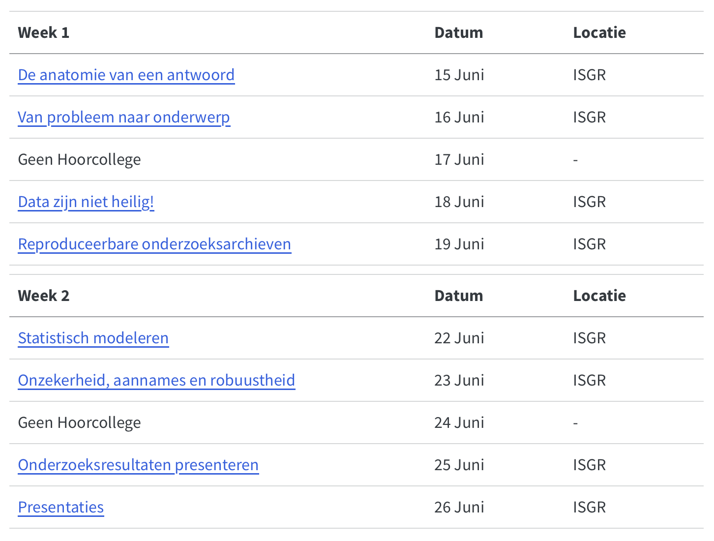

## Becijfering
Het eindcijfer van de module wordt als volgt vastgesteld:

-	Research Project Report: 85%
- Persoonlijke reflectie op de cursus, het proces en de samenwerking met medestudenten: 5%
-	Mondelinge presentatie: 10% 

## Terms I may use

- TDGM: True data generating model
- DGP: Data generating process, closely related to the TDGM, but with all the wacky additional uncertainty
- Truth: The comparative truth that we are interested in
- Bias: The distance to the comparative truth
- Variance: When not everything is the same
- Estimate: Something that we calculate or guess 
- Estimand: The thing we aim to estimate and guess
- Population: That larger entity without sampling variance
- Sample: The smaller thing with sampling variance
- Incomplete: There exists a more complete version, but we don't have it
- Observed: What we have
- Unobserved: What we would also like to have

## At the start

Let's start with the core:

::: {.callout-note appearance="simple"}
# Statistical inference
Statistical inference is the process of drawing conclusions from **truths**
:::

Truths are boring, but they are convenient. 

- however, for most problems truths require a lot of calculations, tallying or a complete census. 
- therefore, a proxy of the truth is in most cases sufficient 
- An example for such a proxy is a **sample**
- Samples are widely used and have been for a long time<footnote>See [Jelke Bethlehem's CBS discussion paper](https://www.google.com/url?sa=t&rct=j&q=&esrc=s&source=web&cd=&ved=2ahUKEwjkyPTCs4L3AhUCuKQKHUpmBvIQFnoECAMQAw&url=https%3A%2F%2Fwww.cbs.nl%2F-%2Fmedia%2Fimported%2Fdocuments%2F2009%2F07%2F2009-15-x10-pub.pdf&usg=AOvVaw3BpUW2s_k0MB5yH1o-QGf2) for an overview of the history of sampling within survey statistics</footnote>


::: footer 
$^1$ See [Jelke Bethlehem's CBS discussion paper](https://www.google.com/url?sa=t&rct=j&q=&esrc=s&source=web&cd=&ved=2ahUKEwjkyPTCs4L3AhUCuKQKHUpmBvIQFnoECAMQAw&url=https%3A%2F%2Fwww.cbs.nl%2F-%2Fmedia%2Fimported%2Fdocuments%2F2009%2F07%2F2009-15-x10-pub.pdf&usg=AOvVaw3BpUW2s_k0MB5yH1o-QGf2) for an overview of the history of survey sampling
:::

## Do we need data?
Without any data we can still come up with a statistically valid answer. 

 - The answer will not be very *informative*. 
 - In order for our answer to be more informative, we need more **information**

Some sources of information can already tremendously guide the precision of our answer. 

::: {.callout-tip}
# In Short
Information bridges the answer to the truth. Too little information may lead you to a *false truth*. 
:::

## Being wrong about the truth
::::{.columns}
:::{.column width="40%"}
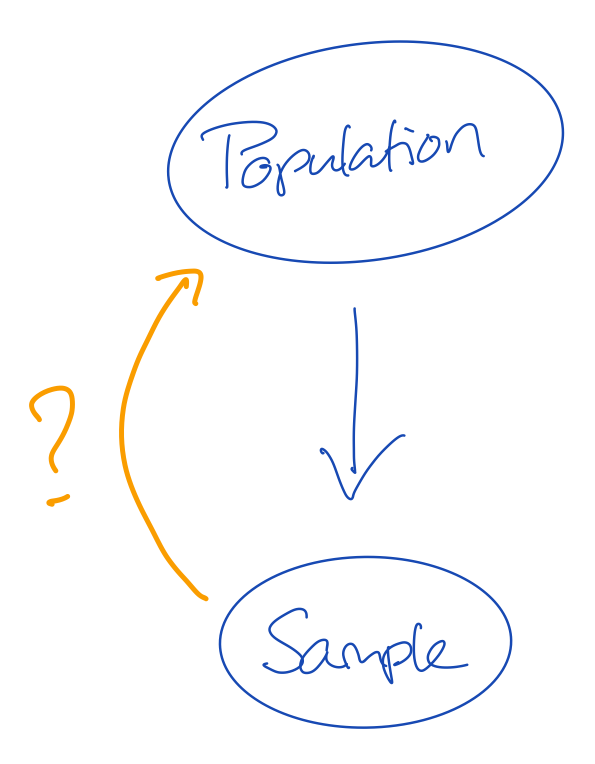{width=90%}
:::

:::{.column width="60%"}
- The population is the truth
- The sample comes from the population, but is generally smaller in size
- This means that not all cases from the population can be in our sample
- If not all information from the population is in the sample, then our sample may be *wrong*

::: {.callout-note}
# Good questions to ask yourself
1. Why is it important that our sample is not wrong?<br>
2. How do we know that our sample is not wrong?
:::
:::
::::

## Solving the missingness problem
::::{.columns}
:::{.column width="40%"}
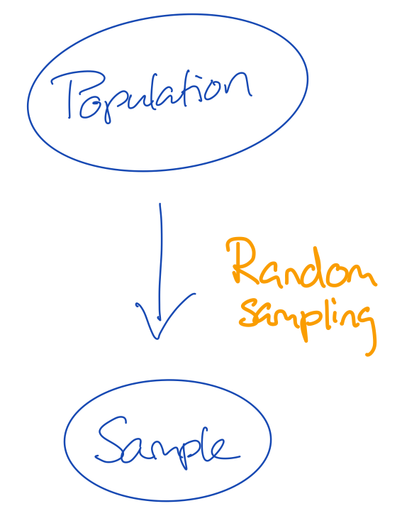{width=90%}
:::

:::{.column width="60%"}
- There are many flavours of sampling
- If we give every unit in the population the same probability to be sampled, we do **random sampling**
- The convenience with random sampling is that the missingness problem can be ignored
- The missingness problem would in this case be: **not every unit in the population has been observed in the sample**

::: {.callout-warning}
# Hmmm...
Would that mean that if we simply observe every potential unit, we would be unbiased about the truth?
:::

:::
::::

## Sidestep
::::{.columns}
:::{.column width="50%"}
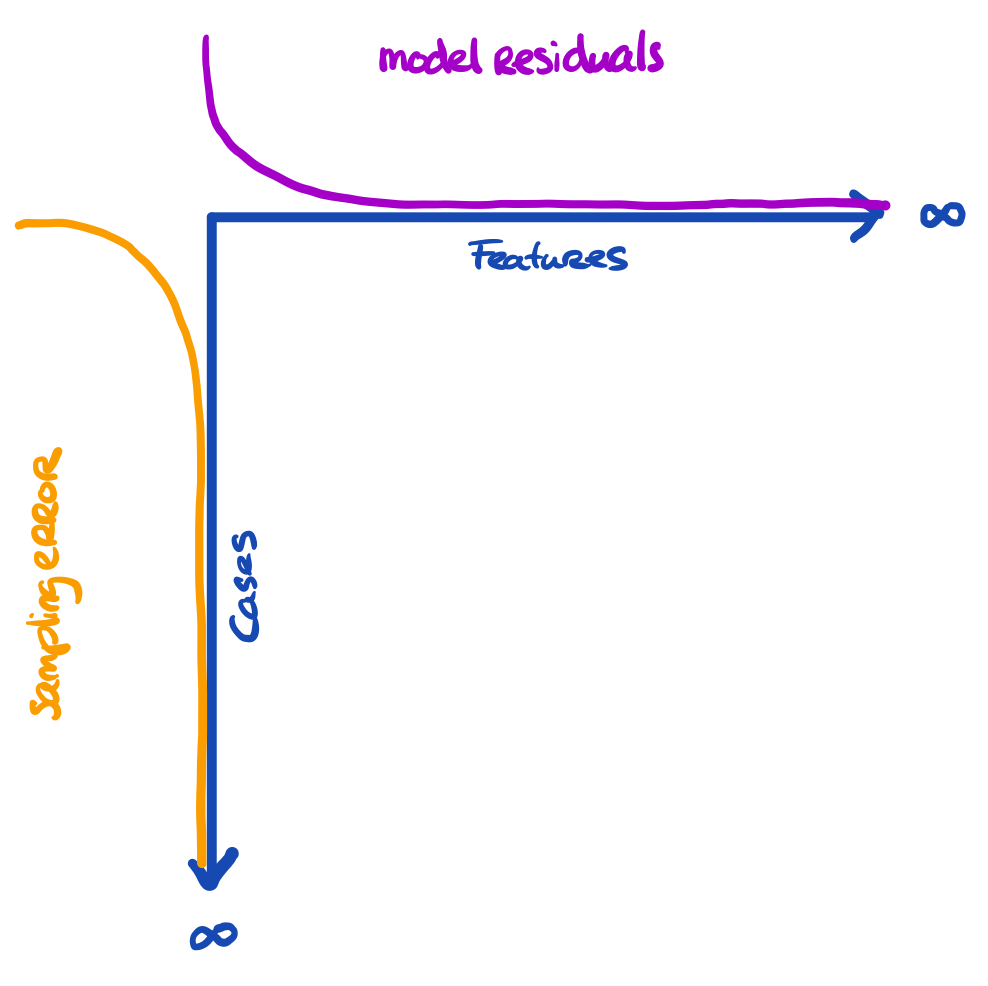{width=90%}
:::

:::{.column width="50%"}
- The problem is a bit larger
- We have three entities at play, here:

  1. The truth we're interested in
  2. The proxy that we have (e.g. sample)
  3. The model that we're running
  
- The more features we use, the more we capture about the outcome for the cases in the data
- The more cases we have, the more we approach the true information
<br><br><br>
All these things are related to uncertainty. Our model can still yield biased results when fitted to $\infty$ features. Our inference can still be wrong when obtained on $\infty$ cases. 
:::
::::

## Sidestep
::::{.columns}
:::{.column width="50%"}
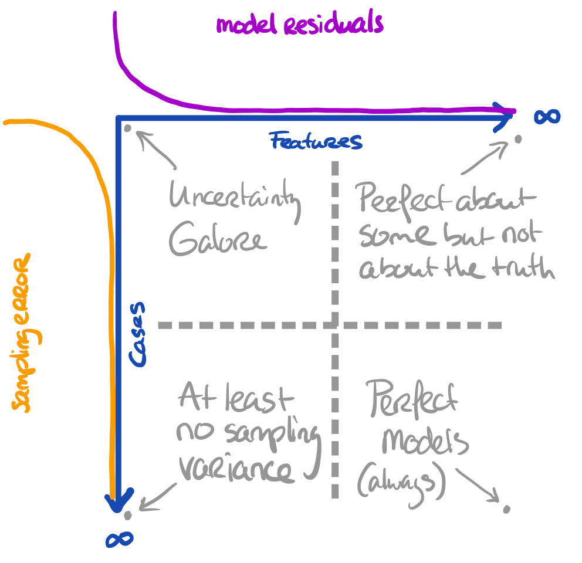{width=90%}
:::

:::{.column width="50%"}
- The problem is a bit larger
- We have three entities at play, here:

  1. The truth we're interested in
  2. The proxy that we have (e.g. sample)
  3. The model that we're running
  
- The more features we use, the more we capture about the outcome for the cases in the data
- The more cases we have, the more we approach the true information
<br><br><br>

**Core assumption: all observations are bonafide**
:::
::::

## Uncertainty simplified
::::{.columns}
:::{.column width="70%"}
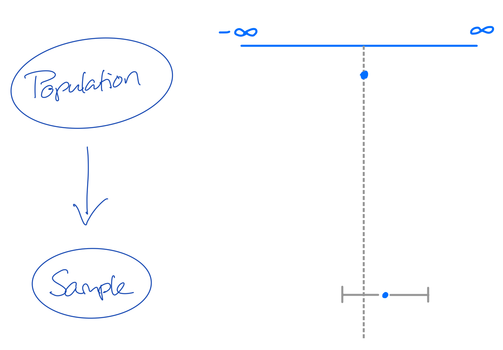{width=90%}
:::

:::{.column width="30%"}
When we do not have all information ...

1. We need to accept that we are probably wrong
2. We just have to quantify how wrong we are

<br>
In some cases we estimate that we are only a bit wrong. In other cases we estimate that we could be very wrong. This is the purpose of testing. 
<br><br>
The uncertainty measures about our estimates can be used to create intervals
:::
::::

## Confidence in the answer
::::{.columns}
:::{.column width="60%"}
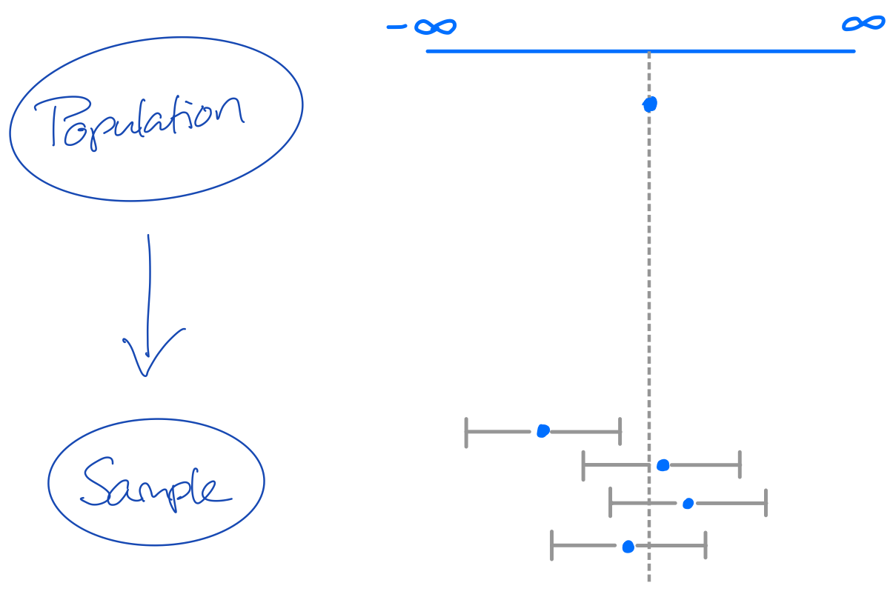{width="90%"}
:::

::: {.column width="40%"}
An intuitive approach to evaluating an answer is confidence. In statistics, we often use confidence intervals. Discussing confidence can be hugely informative!

If we sample 100 samples from a population, then a *95% CI* will cover the **true** population value [at least 95 out of 100 times]{style="text-decoration: underline;"}. 

- If the coverage <95: bad estimation process with risk of errors and invalid inference
- If the coverage >95: inefficient estimation process, but correct conclusions and valid inference. Lower statistical power. 
:::
::::

::: footer 
Neyman, J. (1934). On the Two Different Aspects of the Representative Method: The Method of Stratified Sampling and the Method of Purposive Selection. <br> Journal of the Royal Statistical Society Series A: Statistics in Society, 97(4), 558-606.
:::

## How do we know that our sample is not....
::::{.columns}
:::{.column width="60%"}
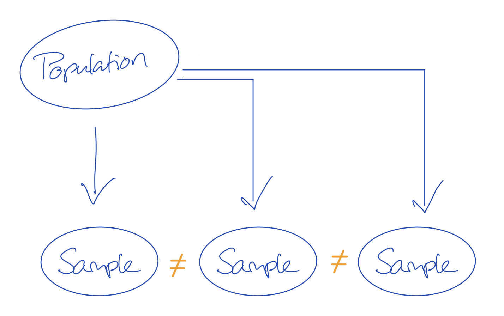{width="90%"}
:::

::: {.column width="40%"}
We can replicate our sample. 

- A replication would be a new sample from the same population or true data generating model obtained by the same data generating process.
- If we would sample 100 times, we would get 100 different samples
- If we would estimate 100 times, we would get 100 different estimates with 100 different confidence intervals (e.g. 95% CI)
- Out of these 100 different intervals, we would expect a nominal coverage. For a 95% CI we'd expect 95 of them to cover the true population value. 
:::
::::

## This is a lot of work...
::::{.columns}
:::{.column width="60%"}
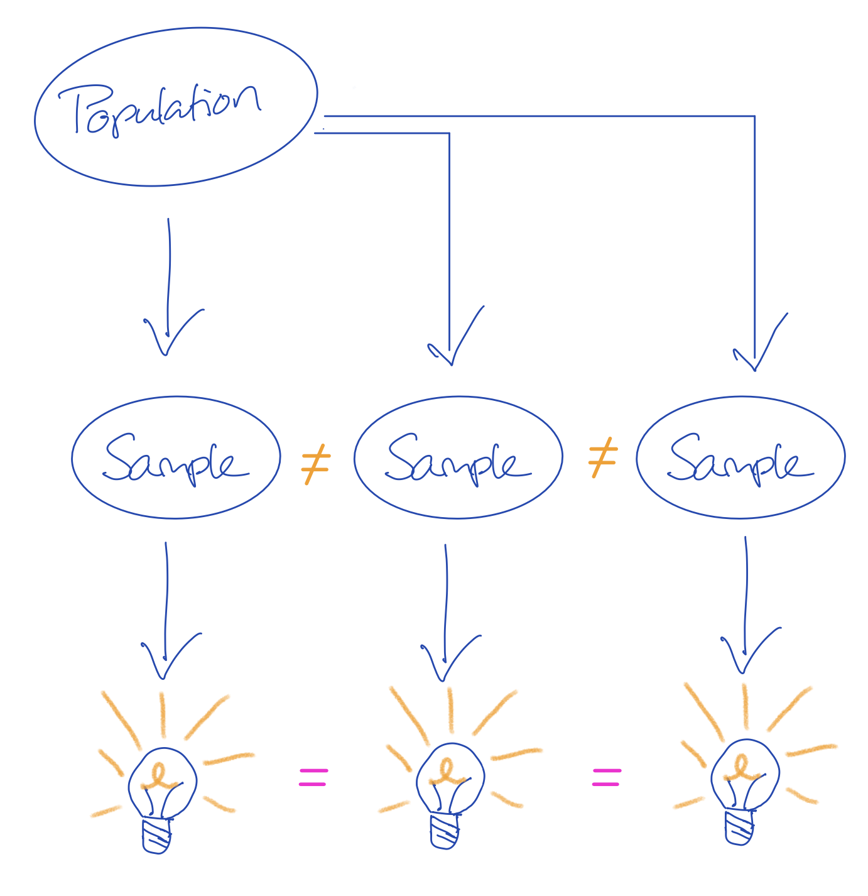{width="80%"}
:::

::: {.column width="40%"}
Full sampling validation of a model's inferences is a lot of work. 

- it is the most robust way of obtaining inferential validity
- it is not always necessary

Under some general assumptions, we can use the same data to validate our model's inferences and predictions.

- these assumptions can be met in practice 
- but as soon as assumptions are made, we open the door to errors when these assumptions do not hold

:::
::::

## Assumptions
Take the following definition:

<center> **a thing that is accepted as true or as certain to happen, without proof.** </center>

Assumptions are a statisticians faith. It is often impossible to prove that they hold in practice, but we choose to believe that they do.

::: {.callout-tip}
# Sensitivity analyses
I often use computational evaluation techniques to quantify the scope of the impact of assumptions made. For example, we can test the effect of violating assumptions on our results. We then verify if the inferences are sensitive to violations of the assumptions. We can even verify the extend of when assumptions start becoming influential to our inferences.
:::

## The holy trinity
Whenever I evaluate something, I tend to look at three things:

- bias (how far from the truth)
- uncertainty/variance (how wide is my interval)
- coverage (how often do I cover the truth with my interval)

As a function of model complexity in specific modeling efforts, these components play a role in the bias/variance tradeoff

:::: {.columns}

::: {.column width="40%"}

:::

::: {.column width="60%"}
{width=40%}
:::

::::

## On the individual level
::::{.columns}
:::{.column width="60%"}
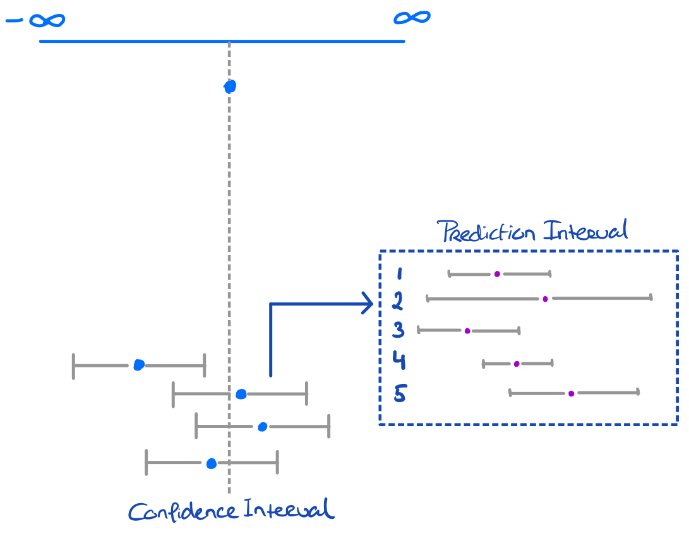{width="90%"}
:::

::: {.column width="40%"}
Individual intervals can also be hugely informative!

Individual intervals are generally wider than confidence intervals

- This is because it covers inherent uncertainty in the data point on top of sampling uncertainty 

::: {.callout-warning}
# Be careful
Narrower intervals mean less uncertainty. 

It does not mean that the answer is correct!
:::

:::
::::

## Case: Spaceshuttle Challenger
36 years ago, on 28 January 1986, 73 seconds into its flight and at an altitude of 9 miles, the space shuttle Challenger experienced an enormous fireball caused by one of its two booster rockets and broke up. The crew compartment continued its trajectory, reaching an altitude of 12 miles, before falling into the Atlantic. All seven crew members, consisting of five astronauts and two payload specialists, were killed.

::::{.columns}
:::{.column width="40%"}
{width=90%}
:::
:::{.column width="60%"}
```{r failure, echo = FALSE, message=FALSE, warning=FALSE, fig.height = 4, fig.width=6}
library(tidyverse)
library(ggplot2)
library(alr4)
set.seed(123)
Challeng %>%
  filter(fail > 0) %>%
  ggplot(aes(temp, fail)) +
  geom_point() +
  #geom_(height = .1, width = .01) +
  geom_smooth(method = "lm", se = FALSE) +
  ylim(0, 5) + xlim(52, 76) +
  ylab("Number of distressed O−rings at each launch") +
  xlab("Temperature in degrees Fahrenheit") +
  theme_classic()
```
:::
::::

## Nothing happened, so we ignored it

::::{.columns}
:::{.column width="50%"}
```{r darkdata, echo = FALSE, message=FALSE, warning=FALSE, fig.width = 5}
set.seed(123)
Challeng %>%
  ggplot(aes(temp, fail)) +
  geom_point() +
  geom_smooth(method = "lm", se = FALSE) +
  ylim(0, 5) + xlim(52, 76) +
  ylab("Number of distressed O−rings at each launch") +
  xlab("Temperature in degrees Fahrenheit") +
  theme_classic()
```
:::
:::{.column width="50%"}
In the decision to proceed with the launch, there was a presence of dark data. And no-one noticed!

Dark data
: Information that is not available but necessary to arrive at the correct answer.

This missing information has the potential to mislead people. The notion that we can be misled is essential because it also implies that artificial intelligence can be misled!

::: {.callout-warning appearance="simple"}
If you don’t have all the information, there is always the possibility of drawing an incorrect conclusion or making a wrong decision.
:::

:::
::::

## In Practice
::::{.columns}
:::{.column width="30%"}
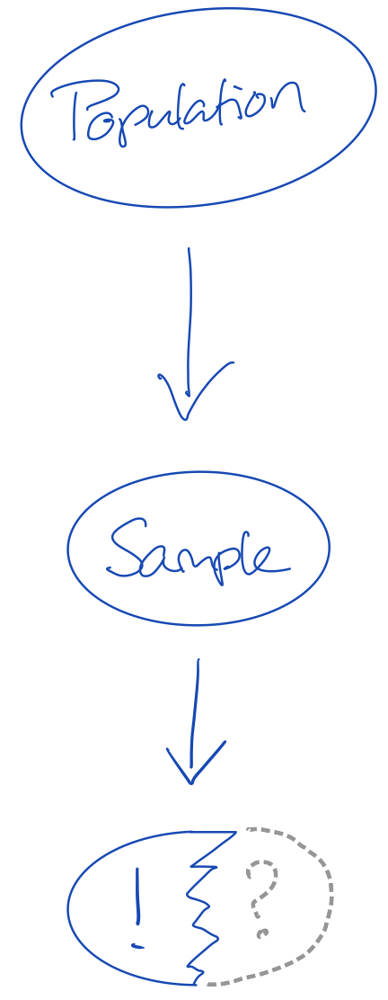{width=60%}
:::

::: {.column width="70%"}

We now have a new problem:

- we do not have the whole truth; but merely a sample of the truth
- we do not even have the whole sample, but merely a sample of the sample of the truth. 


::: {.callout-tip appearance="simple"}
What would be a simple solution to allowing for valid inferences on the incomplete sample? Would that solution work in practice?
:::


:::
::::

## How to fix the missingness problem
::::{.columns}
:::{.column width="50%"}
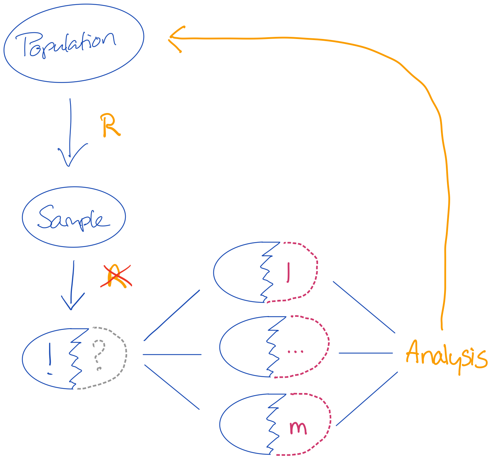{width=80%}
:::

::: {.column width="50%"}
There are two sources of uncertainty that we need to cover when analyzing incomplete data:

1. **Uncertainty about the data values we don't have**:<br>when we don't know what the true observed value should be, we must create a distribution of values with proper variance (uncertainty).
2. **Uncertainty about the process that generated the values we do have**:<br>nothing can guarantee that our sample is the one true sample. So it is reasonable to assume that the parameters obtained on our sample are biased. 

A straightforward and intuitive solution for analyzing incomplete data in such scenarios is *multiple imputation* (Rubin, 1987).
:::
::::

::: footer 
Rubin, D. B. (1987). Multiple imputation for nonresponse in surveys. John Wiley & Sons.
:::

## Now how do we know we did well?
::: callout-important
# I'm really sorry!
In practice we don't know if we did well, because we often lack the necessary comparative truths. 
:::

For example:

1. Predict a future response, but we only have the past
2. Analyzing incomplete data without a reference about the truth
3. Estimate the effect between two things that can never occur together
4. Detecting fraudulent transactions with only access to the own transaction history
5. Appealing to a new customer base with only data about existing customers
6. Mixing bonafide observations with bonafide non-observations

# Wat is dan de anatomie van een antwoord?
## De anatomie van een antwoord

Een statistisch antwoord is meer dan een getal, tabel of modeloutput.

::: {.callout-note appearance="simple"}
# Een goed antwoord
Een goed antwoord verbindt een **vraag**, een **databron**, een **methode**, een **claim** en houdt in het hele proces rekening met **beperkingen**.
:::

Daarom vragen we steeds:

1. Wat willen we weten?
2. Welke data kunnen daarover iets zeggen?
3. Welke vergelijking of schatting is nodig?
4. Welke aannames maken we?
5. Wat mogen we wel en niet concluderen?

> Het is daarbij ook heel belangrijk om regelmatig met alle stakeholders in een onderzoek rond de tafel te gaan zitten. 

## Waarom statistische antwoorden falen

Statistische antwoorden falen vaak niet omdat de software kapot is!

Ze falen omdat:

- de vraag te vaag is
- de data niet passen bij de vraag
- de methode niet past bij het design
- belangrijke informatie ontbreekt
- de interpretatie sterker is dan de analyse toelaat
- beperkingen pas achteraf worden genoemd.
- niet alle betrokken stakeholders ook echt betrokken zijn in het hele proces

> **Een model kan geen onduidelijke vraag repareren!**

## Antwoord of output?

::::{.columns}
:::{.column width="50%"}
### Output

- een regressietabel
- een p-waarde
- een grafiek
- een gemiddelde
- een classificatie
- een AI-samenvatting
:::

:::{.column width="50%"}
### Antwoord

- gericht op een vraag
- gekoppeld aan data
- onderbouwd met methode
- begrensd door aannames
- voorzichtig geïnterpreteerd
- bruikbaar voor besluitvorming
:::
::::

::: {.callout-note appearance="simple"}
Welke output heb je in jouw project nodig om de vraag te kunnen beantwoorden?
:::

## Van onderwerp naar onderzoeksvraag

Een onderwerp is nog geen onderzoeksvraag.

| Breed onderwerp | Onderzoekbare vraag |
|---|---|
| Wateroverlast in Suriname | In welke mate is gerapporteerde wateroverlast onder huishoudens geassocieerd met afwatering, locatie en sociaaleconomische kenmerken? |
| Corruptie en vertrouwen | In welke mate hangen corruptiepercepties samen met vertrouwen in overheidsinstellingen? |
| Taal en rekenprestaties | In welke mate voorspelt Nederlandse taalvaardigheid rekenprestaties, gecontroleerd voor achtergrondkenmerken? |

::: {.callout-note appearance="simple"}
# Vuistregel
Een onderzoeksvraag houdt rekening met minimaal: **populatie**, **uitkomst**, **verklarende variabele of vergelijking**, **context**, **data** en **claim**.
:::

## Claim boundaries
Let er op dat statistiek het domein van wiskunde is waar we probability density functies moeten gebruiken om een antwoord te formuleren.

> Taal maakt het verschil. Zorg dat je conclusie niet sterker is dan dat het design toelaat.

| Sterkere claim | Voorzichtigere claim |
|---|---|
| X causes Y | X hangt samen met Y |
| X explains Y | X is geassocieerd met Y, gegeven Z |
| X predict Y | X heeft voorspellende waarde voor Y |
| Dit geldt voor Suriname | Dit geldt voor de geobserveerde populatie of steekproef |
| De analyse bewijst dat... | De analyse suggereert dat... |


*Goed onderzoek houdt niet alleen rekening met wat we weten of meten, maar ook wat we* **niet** *weten of meten.*

## Voorbeeld: wateroverlast

**Onderwerp**  
Wateroverlast en kwetsbaarheid van huishoudens in Suriname.

**Mogelijke vraag**  
In welke mate is gerapporteerde wateroverlast onder huishoudens in verschillende districten van Suriname geassocieerd met neerslag, toegang tot afwatering, woningkenmerken en sociaaleconomische huishoudkenmerken?

**Mogelijke claim**  
De analyse kan laten zien welke kenmerken samenhangen met gerapporteerde wateroverlast.

**Claimgrens**  
De analyse kan niet zonder aanvullend causaal (experimenteel) design aantonen dat één specifieke factor de wateroverlast veroorzaakt.

## Antwoordkwaliteit

Een goed statistisch antwoord is:

- **relevant**: het beantwoordt de vraag
- **juist**: het volgt uit de data en methode
- **volledig genoeg**: het noemt wat nodig is om het antwoord te begrijpen
- **transparant**: keuzes en beperkingen zijn zichtbaar
- **reproduceerbaar**: de route van data naar resultaat is navolgbaar
- **bescheiden**: de claim is niet sterker dan het design.

> **Antwoordkwaliteit is een vorm van wetenschappelijke integriteit.**

## Take-home message

Statistiek begint niet bij software. Statistiek begint bij een goed geformuleerde vraag, passende data, een eerlijke methode en een verantwoord antwoord. Een goed antwoord is niet alleen correct uitgerekend, maar ook 

- voldoende begrensd, 
- voldoende onderbouwd
- voldoende reproduceerbaar


<!-- # Case 1: How to evaluate without a truth? -->

<!-- ## Scenario  -->
<!-- Let's assume that we have an incomplete data set and that we can impute (fill in) the incomplete values under multiple candidate models -->

<!-- **Challenge**<br> -->
<!-- Imputing this data set under one model may yield different results than imputing this data set under another model. Identify the best model! -->

<!-- **Problem**<br> -->
<!-- We have no idea about validity of either model's results: we would need either the true observed values or the estimand before we can judge the performance and validity of the imputation model. -->

<!-- ::: callout-important -->
<!-- # Not all is lost -->
<!-- We do have a constant in our problem: **the observed values** -->
<!-- ::: -->

<!-- ## Solution - overimpute the observed values -->
<!-- ::::{.columns} -->
<!-- :::{.column width="50%"} -->
<!-- 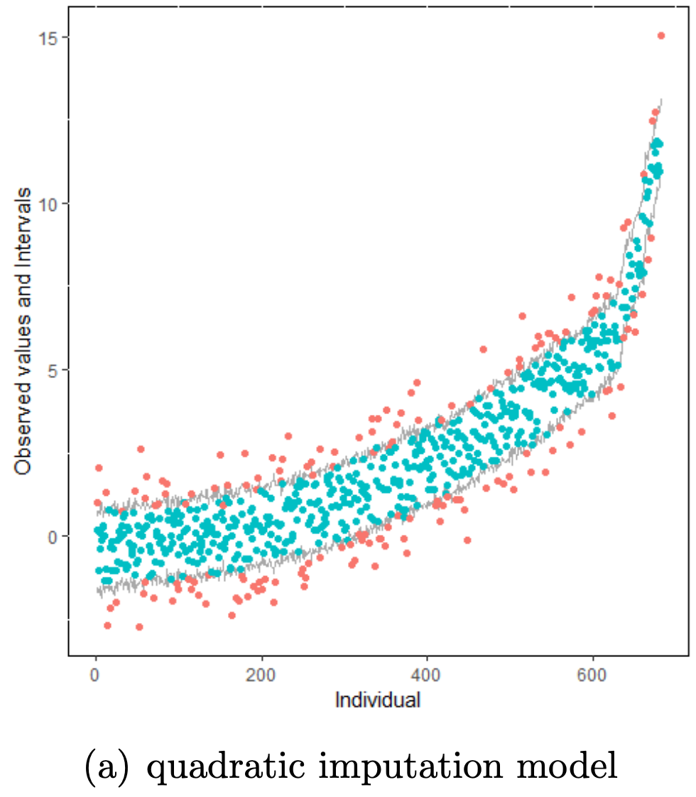{width=80%} -->
<!-- ::: -->
<!-- :::{.column width="50%"} -->
<!-- 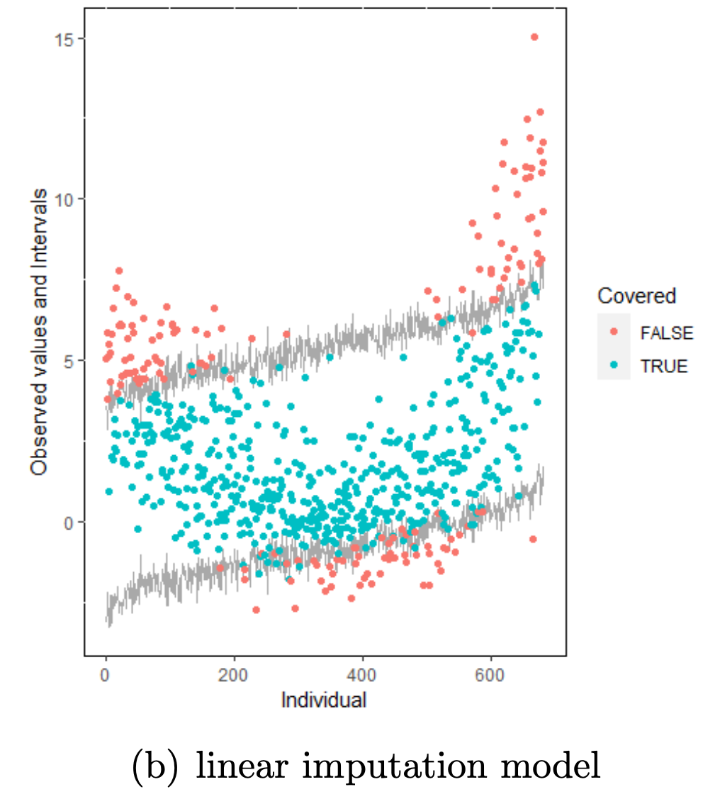{width=80%} -->
<!-- ::: -->


<!-- :::: -->

<!-- ::: footer -->
<!-- Cai, M., van Buuren, S., & Vink, G. (2022). Graphical and numerical diagnostic tools to assess multiple imputation models by posterior predictive checking.  -->
<!-- ::: -->

<!-- # Case 2: When you suspect your model is wrong -->

<!-- ## Scenario -->

<!-- - 1236 citizens of Leiden who were 85 years or older on December 1, 1986 (Lagaay, Van der Meij, and Hijmans 1992).  -->
<!-- - Visited by a physician between January 1987 and May 1989.  -->
<!-- - A full medical history, information on current use of drugs, a venous blood sample, and other health-related data were obtained.  -->
<!-- - BP was routinely measured during the visit.  -->
<!--   - Apart from some individuals who were bedridden, BP was measured while seated.  -->
<!--   - An Hg manometer was used and BP was rounded to the nearest 5 mmHg.  -->
<!-- - The mortality status of each individual on March 1, 1994 was retrieved from administrative sources. -->

<!-- ::: footer -->
<!-- Lagaay, A. M., J. C. Van der Meij, and W. Hijmans. 1992. “Validation of Medical History Taking as Part of a Population Based Survey in Subjects Aged 85 and over.” British Medical Journal 304 (6834): 1091–2. -->
<!-- ::: -->


<!-- ## Problem -->
<!-- - BP was measured less frequently for very old persons and for persons with health problems.  -->
<!-- - BP was measured more often if the BP was too high, for example if the respondent indicated a previous diagnosis of hypertension, or if the respondent used any medication against hypertension.  -->
<!-- - The missing data rate of BP also varied during the period of data collection.  -->
<!--   - The rate gradually increases during the first seven months of the sampling period from 5 to 40 percent of the cases, and then suddenly drops to a fairly constant level of 10–15 percent.  -->
<!--   - A complicating factor here is that the sequence in which the respondents were interviewed was not random.  -->
<!--   - High-risk groups, that is, elderly in hospitals and nursing homes and those over 95, were visited first. -->

<!-- ## Survival rate -->
<!-- 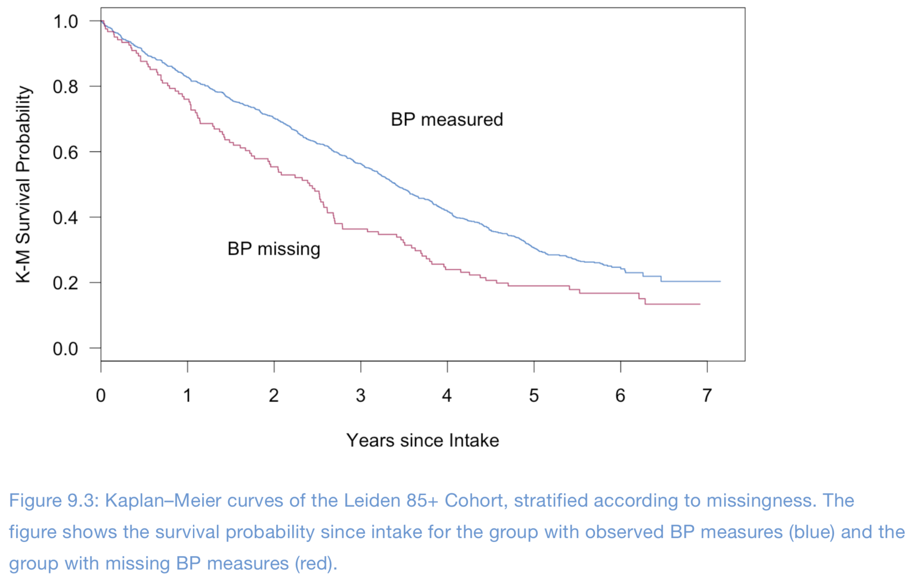 -->

<!-- ::: footer -->
<!-- Van Buuren, S. (2018). Flexible imputation of missing data. CRC press. Chapter 9.2 -->
<!-- ::: -->

<!-- ## Missingness -->
<!-- 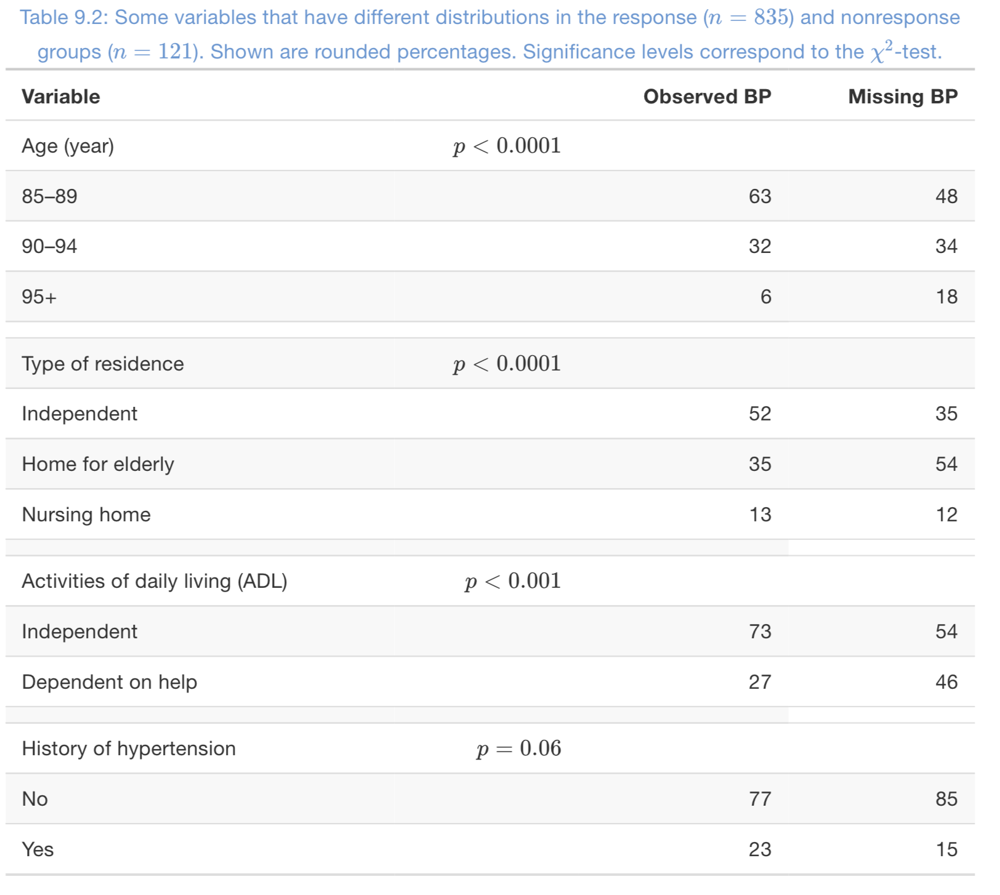{width=50%} -->

<!-- ::: footer -->
<!-- Van Buuren, S. (2018). Flexible imputation of missing data. CRC press. Chapter 9.2 -->
<!-- ::: -->

<!-- ## Sensitivity analysis -->
<!-- 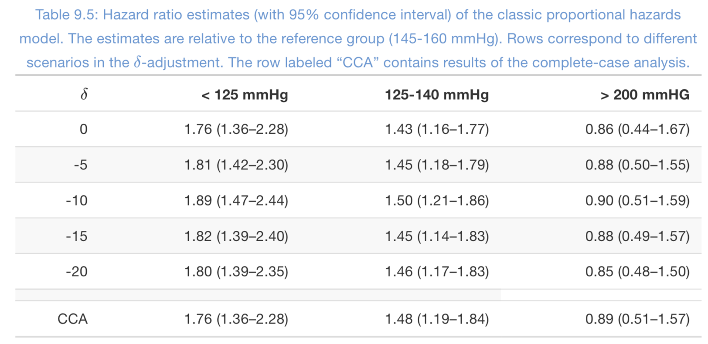{width="70%"} -->

<!-- ::: footer -->
<!-- Van Buuren, S. (2018). Flexible imputation of missing data. CRC press. Chapter 9.2 -->
<!-- ::: -->

<!-- # Case 3: When you know you're wrong -->

<!-- ## Scenario -->

<!-- In a survey about research integrity and fraud we surveyed behaviours and practices in the following format.  -->

<!-- <center> -->
<!-- {width=60%} -->
<!-- </center> -->
<!-- <br> -->
<!-- Many behaviours were surveyed over multiple groups of people. Some findings: -->

<!-- - In most groups similar behavioural prevalence was observed.  -->
<!-- - When looking at subgroups, prevalences differ between subgroups. -->
<!-- - Not applicables were much more prevalent in one group than in other groups -->
<!-- - There are too few cases and too many patterns with `Not Applicable`'s over features to allow for a pattern-wise analysis (stratified analysis). -->
<!-- - There are too many `Not Applicables` to allow for *listwise deletion*. -->

<!-- ## Some background -->
<!-- We know:  -->

<!-- 1. `Not Applicable` is not randomly distributed over the data. Removing them is therefore not valid! -->
<!-- 2. `Not Applicable` are bonafide missing values: there should be no observations. -->

<!-- ::: callout-important -->
<!-- # There's no such thing as a free lunch -->

<!-- Every imputation will bias the results. For some we know the direction of the bias, for some we have no idea. We do not have access to the truth. -->
<!-- ::: -->

<!-- ### What would you do? -->

<!-- ## Our solution -->
<!-- We chose to impute the data as `1 (never)`. There are a couple of reasons why we think that this is the best defendable scenario. -->

<!-- 1. `Never` has a semantic similarity to a behaviour not being applicable. However,  `Never` implies intentionality; `Not Applicable` does not. -->
<!-- 2. We know the effect the imputation has on the inference: Filling in `Never` will underestimate intentional behaviours.  -->

<!-- In this case the choice was made to make a **deliberate error**. The estimates obtained would serve as an underestimation of *true behaviour* and can be considered a lower bound estimation.  -->

## To conclude

