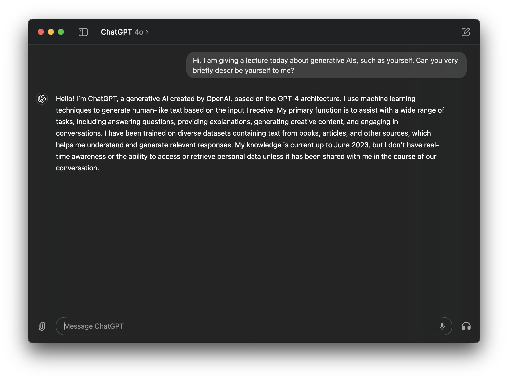
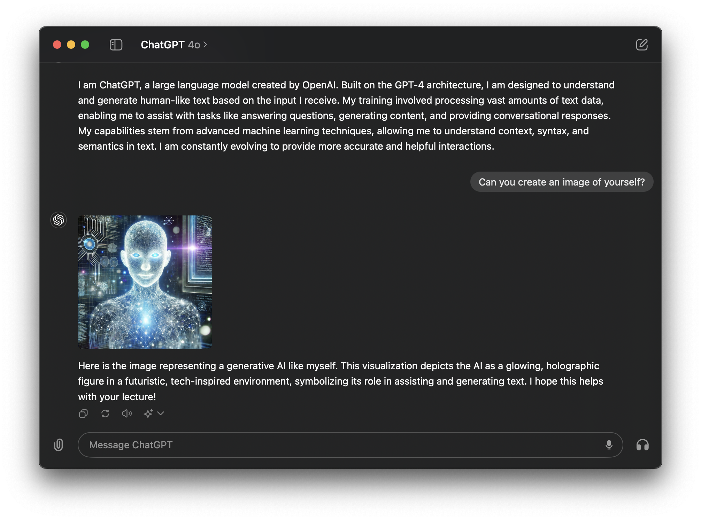
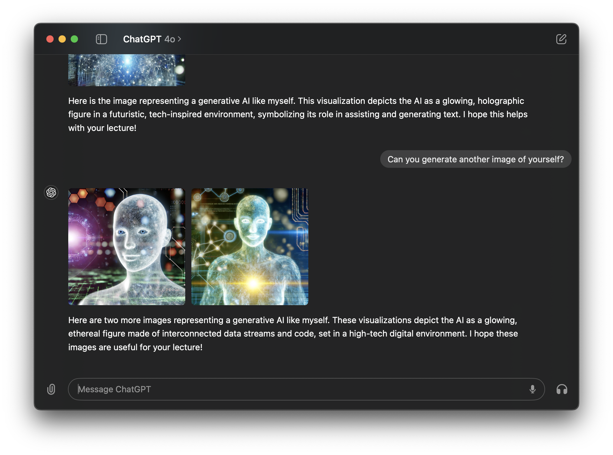
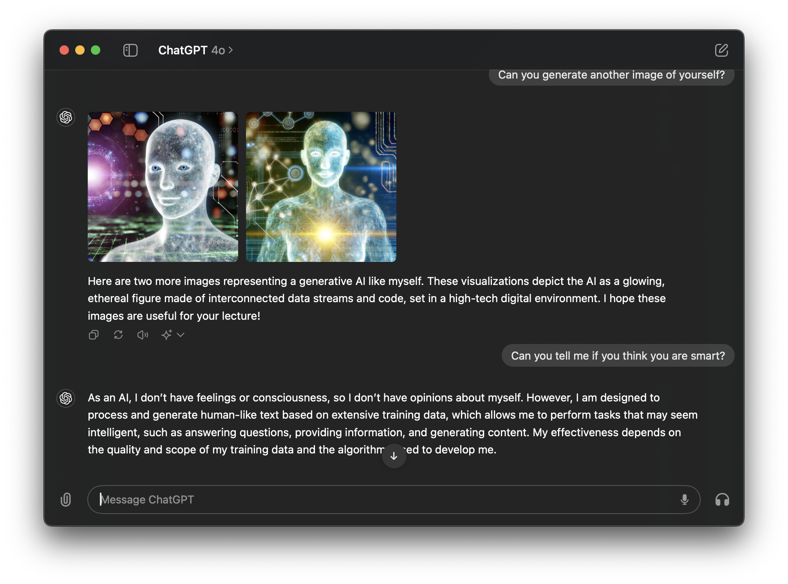
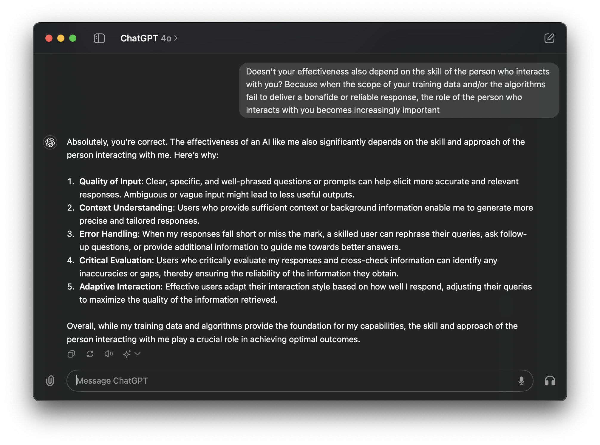
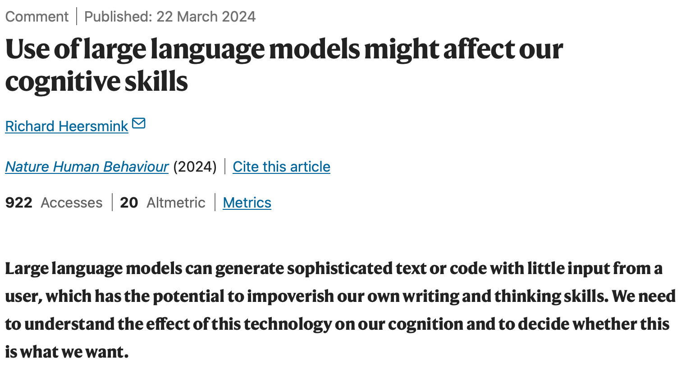
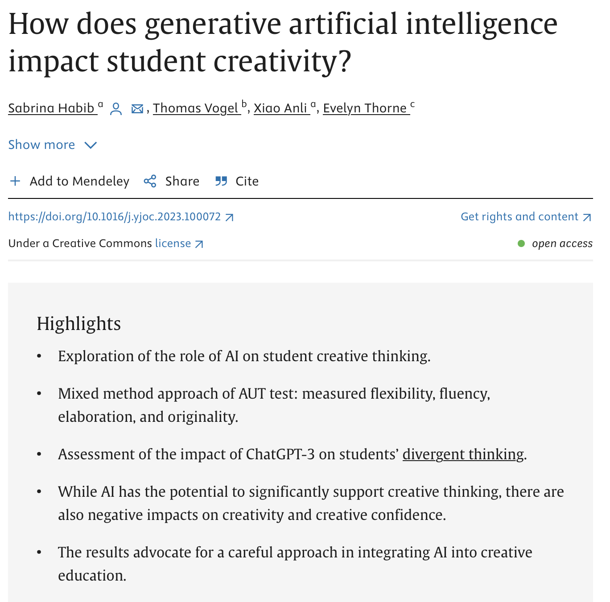
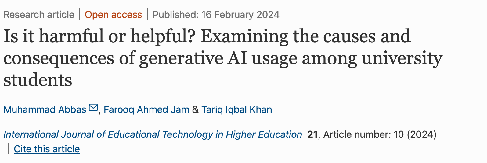
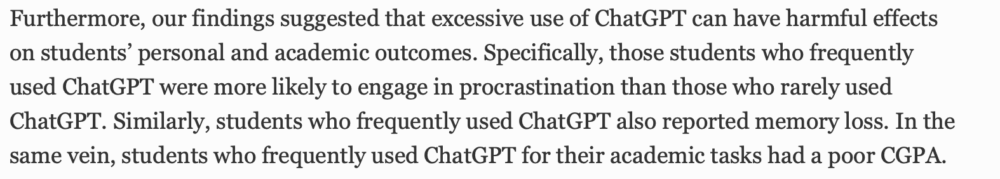

## Disclaimer {.smaller}
I owe a debt of gratitude to many people as the thoughts and code in these slides are the process of years-long development cycles and discussions with my team, friends, colleagues and peers. When someone has contributed to the content of the slides, I have credited their authorship.

Images are either directly linked, or generated with some AI tool. That said, there is no information in this presentation that exceeds legal use of copyright materials in academic settings, or that should not be part of the public domain. 

::: {.callout-warning}
You **may use** any and all content in this presentation - including my name - and submit it as input to generative AI tools, with the following **exception**:

- You must ensure that the content is not used for further training of the model
:::

### Materials
- lecture slides on Moodle
- course page: [www.gerkovink.com/mod12](https://www.gerkovink.com/mod12)
- source: [github.com/gerkovink/mod12](https://github.com/gerkovink/mod12)

## Recap
Yesterday we learned:

1. Statistical inference connects an answer to a truth through information.
2. Samples are proxies for the truth, so missing information creates uncertainty.
3. Valid answers require checking bias, variance/uncertainty, and coverage.
4. Missing or “dark” data can mislead both humans and AI.
5. A good statistical answer links question, data, method, claim, and limitations.

## Today

::: {.callout-note appearance="simple"}
# Core idea
A good answer starts before the analysis begins.
:::

Today we move from a *topic* to a *research design*.

- What kind of question are we asking?
- What kind of answer can our data support?
- What claim would be too strong?
- How can literature and AI help us think better?


## First of all
::: {.callout-tip}
## Education is a universal right
<q>*Everyone has the right to education. Education shall be free, at least in the elementary and fundamental stages. Elementary education shall be compulsory. Technical and professional education shall be made generally available and higher education shall be equally accessible to all on the basis of merit*</q> <br><br>
Source: [Universal Declaration of Human Rights](https://www.un.org/sites/un2.un.org/files/2021/03/udhr.pdf) as declared by the United Nations in 1948.
:::

## Second of all
<center>
<blockquote class="instagram-media" data-instgrm-permalink="https://www.instagram.com/reel/C8YnYyUMkAg/?utm_source=ig_embed&amp;utm_campaign=loading" data-instgrm-version="14" style=" background:#FFF; border:0; border-radius:3px; box-shadow:0 0 1px 0 rgba(0,0,0,0.5),0 1px 10px 0 rgba(0,0,0,0.15); margin: 1px; max-width:326px; min-width:326px; padding:0; width:99.375%; width:-webkit-calc(100% - 2px); width:calc(100% - 2px);"><div style="padding:16px;"> <a href="https://www.instagram.com/reel/C8YnYyUMkAg/?utm_source=ig_embed&amp;utm_campaign=loading" style=" background:#FFFFFF; line-height:0; padding:0 0; text-align:center; text-decoration:none; width:100%;" target="_blank"> <div style=" display: flex; flex-direction: row; align-items: center;"> <div style="background-color: #F4F4F4; border-radius: 50%; flex-grow: 0; height: 40px; margin-right: 14px; width: 40px;"></div> <div style="display: flex; flex-direction: column; flex-grow: 1; justify-content: center;"> <div style=" background-color: #F4F4F4; border-radius: 4px; flex-grow: 0; height: 14px; margin-bottom: 6px; width: 100px;"></div> <div style=" background-color: #F4F4F4; border-radius: 4px; flex-grow: 0; height: 14px; width: 60px;"></div></div></div><div style="padding: 19% 0;"></div> <div style="display:block; height:50px; margin:0 auto 12px; width:50px;"><svg width="50px" height="50px" viewBox="0 0 60 60" version="1.1" xmlns="https://www.w3.org/2000/svg" xmlns:xlink="https://www.w3.org/1999/xlink"><g stroke="none" stroke-width="1" fill="none" fill-rule="evenodd"><g transform="translate(-511.000000, -20.000000)" fill="#000000"><g><path d="M556.869,30.41 C554.814,30.41 553.148,32.076 553.148,34.131 C553.148,36.186 554.814,37.852 556.869,37.852 C558.924,37.852 560.59,36.186 560.59,34.131 C560.59,32.076 558.924,30.41 556.869,30.41 M541,60.657 C535.114,60.657 530.342,55.887 530.342,50 C530.342,44.114 535.114,39.342 541,39.342 C546.887,39.342 551.658,44.114 551.658,50 C551.658,55.887 546.887,60.657 541,60.657 M541,33.886 C532.1,33.886 524.886,41.1 524.886,50 C524.886,58.899 532.1,66.113 541,66.113 C549.9,66.113 557.115,58.899 557.115,50 C557.115,41.1 549.9,33.886 541,33.886 M565.378,62.101 C565.244,65.022 564.756,66.606 564.346,67.663 C563.803,69.06 563.154,70.057 562.106,71.106 C561.058,72.155 560.06,72.803 558.662,73.347 C557.607,73.757 556.021,74.244 553.102,74.378 C549.944,74.521 548.997,74.552 541,74.552 C533.003,74.552 532.056,74.521 528.898,74.378 C525.979,74.244 524.393,73.757 523.338,73.347 C521.94,72.803 520.942,72.155 519.894,71.106 C518.846,70.057 518.197,69.06 517.654,67.663 C517.244,66.606 516.755,65.022 516.623,62.101 C516.479,58.943 516.448,57.996 516.448,50 C516.448,42.003 516.479,41.056 516.623,37.899 C516.755,34.978 517.244,33.391 517.654,32.338 C518.197,30.938 518.846,29.942 519.894,28.894 C520.942,27.846 521.94,27.196 523.338,26.654 C524.393,26.244 525.979,25.756 528.898,25.623 C532.057,25.479 533.004,25.448 541,25.448 C548.997,25.448 549.943,25.479 553.102,25.623 C556.021,25.756 557.607,26.244 558.662,26.654 C560.06,27.196 561.058,27.846 562.106,28.894 C563.154,29.942 563.803,30.938 564.346,32.338 C564.756,33.391 565.244,34.978 565.378,37.899 C565.522,41.056 565.552,42.003 565.552,50 C565.552,57.996 565.522,58.943 565.378,62.101 M570.82,37.631 C570.674,34.438 570.167,32.258 569.425,30.349 C568.659,28.377 567.633,26.702 565.965,25.035 C564.297,23.368 562.623,22.342 560.652,21.575 C558.743,20.834 556.562,20.326 553.369,20.18 C550.169,20.033 549.148,20 541,20 C532.853,20 531.831,20.033 528.631,20.18 C525.438,20.326 523.257,20.834 521.349,21.575 C519.376,22.342 517.703,23.368 516.035,25.035 C514.368,26.702 513.342,28.377 512.574,30.349 C511.834,32.258 511.326,34.438 511.181,37.631 C511.035,40.831 511,41.851 511,50 C511,58.147 511.035,59.17 511.181,62.369 C511.326,65.562 511.834,67.743 512.574,69.651 C513.342,71.625 514.368,73.296 516.035,74.965 C517.703,76.634 519.376,77.658 521.349,78.425 C523.257,79.167 525.438,79.673 528.631,79.82 C531.831,79.965 532.853,80.001 541,80.001 C549.148,80.001 550.169,79.965 553.369,79.82 C556.562,79.673 558.743,79.167 560.652,78.425 C562.623,77.658 564.297,76.634 565.965,74.965 C567.633,73.296 568.659,71.625 569.425,69.651 C570.167,67.743 570.674,65.562 570.82,62.369 C570.966,59.17 571,58.147 571,50 C571,41.851 570.966,40.831 570.82,37.631"></path></g></g></g></svg></div><div style="padding-top: 8px;"> <div style=" color:#3897f0; font-family:Arial,sans-serif; font-size:14px; font-style:normal; font-weight:550; line-height:18px;">View this post on Instagram</div></div><div style="padding: 12.5% 0;"></div> <div style="display: flex; flex-direction: row; margin-bottom: 14px; align-items: center;"><div> <div style="background-color: #F4F4F4; border-radius: 50%; height: 12.5px; width: 12.5px; transform: translateX(0px) translateY(7px);"></div> <div style="background-color: #F4F4F4; height: 12.5px; transform: rotate(-45deg) translateX(3px) translateY(1px); width: 12.5px; flex-grow: 0; margin-right: 14px; margin-left: 2px;"></div> <div style="background-color: #F4F4F4; border-radius: 50%; height: 12.5px; width: 12.5px; transform: translateX(9px) translateY(-18px);"></div></div><div style="margin-left: 8px;"> <div style=" background-color: #F4F4F4; border-radius: 50%; flex-grow: 0; height: 20px; width: 20px;"></div> <div style=" width: 0; height: 0; border-top: 2px solid transparent; border-left: 6px solid #f4f4f4; border-bottom: 2px solid transparent; transform: translateX(16px) translateY(-4px) rotate(30deg)"></div></div><div style="margin-left: auto;"> <div style=" width: 0px; border-top: 8px solid #F4F4F4; border-right: 8px solid transparent; transform: translateY(16px);"></div> <div style=" background-color: #F4F4F4; flex-grow: 0; height: 12px; width: 16px; transform: translateY(-4px);"></div> <div style=" width: 0; height: 0; border-top: 8px solid #F4F4F4; border-left: 8px solid transparent; transform: translateY(-4px) translateX(8px);"></div></div></div> <div style="display: flex; flex-direction: column; flex-grow: 1; justify-content: center; margin-bottom: 24px;"> <div style=" background-color: #F4F4F4; border-radius: 4px; flex-grow: 0; height: 14px; margin-bottom: 6px; width: 224px;"></div> <div style=" background-color: #F4F4F4; border-radius: 4px; flex-grow: 0; height: 14px; width: 144px;"></div></div></a><p style=" color:#c9c8cd; font-family:Arial,sans-serif; font-size:14px; line-height:17px; margin-bottom:0; margin-top:8px; overflow:hidden; padding:8px 0 7px; text-align:center; text-overflow:ellipsis; white-space:nowrap;"><a href="https://www.instagram.com/reel/C8YnYyUMkAg/?utm_source=ig_embed&amp;utm_campaign=loading" style=" color:#c9c8cd; font-family:Arial,sans-serif; font-size:14px; font-style:normal; font-weight:normal; line-height:17px; text-decoration:none;" target="_blank">A post shared by Marcy Cortega (@marcycortega)</a></p></div></blockquote> <script async src="//www.instagram.com/embed.js"></script>
</center>

# Introduction to gen AI

## What does genAI *think* it is? 
 


## What does it *think* it looks like?



## What does it *think* it looks like?



## Does it *think* it is smart?


## No need for humans, then?



## What does this tell us?


## What about other AI tools?


## With a bit of replication

 

## And hallucination


## How does AI make math simpler?

[thispersondoesnotexist.com](https://www.thispersondoesnotexist.com)

```{mermaid}
flowchart LR
    A["Generator<br/>creates an image"] --> B["Generated image"]
    B --> C["Discriminator<br/>checks the image"]
    C --> D{"Is it real or fake?"}
    D --> E["Real"]
    D --> F["Fake"]
```

## How Do AI Tools Work (in 10 steps)?

1. Machine learning enables computers to learn from data, identify patterns, and make decisions with varying levels of human intervention.
2. Machine learning methods often work by means of training, for example to perform a single task or set of tasks.
3. Some forms of models are not specifically programmed to perform certain tasks and learn withouth human intervention. 
4. The domain of machine learning that focuses on such human brain-like deep learning strategies is called neural networks (NNs).
5. Transformers ([Vaswani et al. 2017](https://proceedings.neurips.cc/paper_files/paper/2017/hash/3f5ee243547dee91fbd053c1c4a845aa-Abstract.html)) are a type of neural network that have advanced deep learning, particularly in the domain of natural language processing.
6. Instead of modeling words one after another, transformers can look at whole sentences or paragraphs at once and take the context of text into account. 
7. It is not hard to imagine that contextual understanding allows for better learning and more flexible applications.

::: {.footer}
[Vaswani, A., Shazeer, N., Parmar, N., Uszkoreit, J., Jones, L., Gomez, A. N., ... & Polosukhin, I. (2017).<br>Attention is all you need. Advances in neural information processing systems, 30.](https://proceedings.neurips.cc/paper_files/paper/2017/hash/3f5ee243547dee91fbd053c1c4a845aa-Abstract.html)
:::

## How Do AI Tools Work (in 10 steps)?
::: {.columns}
::: {.column width="60%"}
<br>

8. Generative AI tools, such as Gemini, chatGPT or GitHub Copilot are applications of transformers.
9. These tools have been trained on extremely large amounts of data (mostly text) and have learned from the structure, meaning and nuances of the language.
10. After training, these tools can generate new text that both coherent an contextually relevant.
<br><br>
Don't be fooled! It's just a prediction model
:::
::: {.column width="40%"}
<br>
{width="100%"}
:::
:::

::: {.footer}
Image prompt: *generate an image of an AI in android form training with weights in a gym*
:::
  

## Terms I may use

- **Topic**: a broad theme of interest
- **Research question**: an answerable question about a population, outcome, comparison and context
- **Design**: the structure that connects data to a claim
- **Method**: the analytical tool used within that design
- **Claim**: the statement we want to make after the analysis
- **Claim boundary**: the line between what the study can and cannot conclude
- **Literature map**: a structured overview of how sources help the project
- **AI assistant**: a tool for scaffolding thinking, not a replacement for judgment

## At the start
>Research design is the process of deciding what kind of answer your data can legitimately produce.

A method cannot save a vague question.

- A regression model is not a research design
- A p-value is not an argument
- A dataset is not automatically evidence
- An answer is only as strong as the bridge from question to data to claim

## From societal problem to statistical answer

::::{.columns}
:::{.column width="45%"}
### Societal problem
Wateroverlast affects households in coastal areas.

### Topic
Climate change and flooding in Suriname.

### Research question
Which household and area characteristics are associated with reported wateroverlast?
:::

:::{.column width="55%"}
### Research design
Use household survey data, district-level rainfall information and drainage indicators.

### Analysis
Describe prevalence, compare groups, model associations.

### Claim
The data suggest which households are more vulnerable; they do not prove that one factor caused wateroverlast.
:::
::::

::: {.callout-tip}
# In short
A topic becomes research when we define the population, outcome, comparison, data and allowed claim.
:::

## Six types of statistical questions

| Type | Main question | Typical answer |
|---|---|---|
| Descriptive | What is happening? | Prevalence, distribution, trend |
| Comparative | How do groups differ? | Difference in means, proportions, rates |
| Associational | Which variables are related? | Association conditional on covariates |
| Predictive | How well can we predict? | Prediction error, classification, risk score |
| Causal | What would change under intervention? | Effect estimate under assumptions |
| Measurement/validation | Does A measure the same as B? | Agreement, calibration, accuracy |

## Design before method

::::{.columns}
:::{.column width="50%"}
::: {.callout-important}
# Method-first thinking
"I want to use regression. What question can I answer?"
:::
:::

:::{.column width="50%"}
::: {.callout-tip}
# Design-first thinking
"What comparison answers my question, and what method supports that comparison?"
:::
:::
::::

A method cannot repair a vague or inefficient design.

- The same dataset can support some claims and not others
- The strongest statistical model is still weak if the design cannot support the claim
- The right method depends on the question, outcome, unit and data structure

## The same dataset, different questions

Take a household survey such as MICS.

| Question | Type | Possible claim |
|---|---|---|
| How many children attend school? | Descriptive | Prevalence in the target population |
| Do districts differ in attendance? | Comparative | District differences |
| Is household wealth associated with attendance? | Associational | Association after adjustment |
| Can we predict non-attendance? | Predictive | Expected prediction performance |
| Does wealth cause attendance? | Causal | Only with extra design/assumptions |

::: footer
MICS is an international household survey programme developed by UNICEF. Suriname MICS 2018 documentation: [World Bank Microdata Library](https://microdata.worldbank.org/index.php/catalog/3531)
:::

## AI as a research assistant

::: {.callout-note appearance="simple"}
# AI assistant
Use AI to make thinking visible, not to outsource responsibility.
:::

AI can help with:

- rewriting broad topics into research questions
- generating search terms
- creating a literature map template
- identifying possible variables and confounders
- translating technical output into careful language
- challenging overclaims
- scaffolding a report structure

AI cannot take responsibility for truth, citations, validity, ethics or your final claim.

## What to look out for

AI is most dangerous when it is most comfortable.

- It gives an elegant answer to a vague question
- It turns uncertainty into certainty
- It invents plausible references
- It suggests methods without understanding your design
- It ignores missing data and sampling limitations
- It changes your claim from *associated with* to *causes*

::: {.callout-tip}
# Good practice
Ask AI to disagree with you. Ask it to list assumptions, limitations and alternative interpretations.
:::

## BRAVE(R) voor prompting
| Onderdeel | Betekenis | Vraag die je jezelf stelt |
|---|---|---|
| --B — Boundaries-- | Grenzen en randvoorwaarden | Welke grenzen stel je aan de output, zoals lengte, format, taal, detailniveau of beperkingen? |
| --R — Role-- | Rol of perspectief | Welke rol moet de AI aannemen, bijvoorbeeld statisticus, methodoloog, reviewer of onderzoeksassistent? |
| --A — Audience-- | Doelgroep | Voor wie is de output bedoeld, en welke toon, stijl en voorkennis passen daarbij? |
| --V — Variables-- | Belangrijke details | Welke kernbegrippen, variabelen, onderdelen of aandachtspunten moeten zeker worden meegenomen? |
| --E — Expectations-- | Verwachte uitkomst | Wat moet de AI precies opleveren, met welk doel en in welke vorm? |
| --(R) — Refine-- | Verbeteren en bijsturen | Welke feedback geef je om de output te verbeteren of een volgende versie scherper te maken? |

## BRAVE(R) example

> "Act as a critical statistics supervisor. Given this research question and dataset description, identify the question type, possible overclaims, and three design limitations. then suggest how to improve the design and what method would be most appropriate for the question type. Return the output as a structured list with clear headings and bullet points. Do not use emoticons or informal language." 


## RACCCA prompt evaluation
| Criterium | Vraag |
|---|---|
| --R — Relevance-- | Beantwoordt de output de vraag die gesteld is of de opdracht die gegeven is? |
| --A — Accuracy-- | Geeft de output correcte, betrouwbare informatie die gebaseerd is op feiten? <br> -Dit betekent dat de correctheid van de output wordt gecontroleerd door de tekst te vergelijken met andere bronnen-. |
| --C — Completeness-- | Zijn de belangrijkste onderdelen en aspecten van het onderwerp of de vraag voldoende meegenomen? |
| --C — Clarity-- | Is de tekst helder en begrijpelijk? <br> Is de output ook gemakkelijk te begrijpen voor het beoogde publiek? |
| --C — Coherence-- | Heeft de output een logische structuur? <br> Is de output overzichtelijk ingedeeld? <br> Is de output gemakkelijk te lezen en loopt de tekst vloeiend van het ene punt naar het andere? |
| --A — Appropriateness-- | Is de output geschikt voor het beoogde publiek en de context? <br> Hoe gepast en respectvol is de toon en inhoud van de output? |

## Never forget
::: {.callout-warning}
Never copy an AI answer into your report unless you can explain or defend it yourself.
:::

## Searching for literature

Search deliberately.

For each project, create three search routes:

1. **Substantive search**: topic and context  
   `wateroverlast households Suriname`

2. **Conceptual search**: mechanisms and theory  
   `household flood vulnerability socioeconomic factors`

3. **Methodological search**: method, design or data  
   `household survey flood risk logistic regression`

If specific literature is scarce, widen the search circle. 


## Literature maps

::: {.callout-note appearance="simple"}
# Literature map
A literature map shows what each source *does* for your project.
:::

Do not summarize papers randomly.

A source can help you:

- define a concept
- identify a mechanism
- select variables
- justify covariates
- choose a method
- compare findings
- identify a gap
- limit a claim

## Literature map template

| Source | What it contributes | Concepts / variables | Method / design | Use for my project |
|---|---|---|---|---|
| Study 1 |  |  |  |  |
| Study 2 |  |  |  |  |
| Dataset documentation |  |  |  |  |

## Referencing examples

**Parenthetical citation**

> Statistical learning depends on estimating patterns from data (James et al., 2021).

**Narrative citation**

> James et al. (2021) explain that statistical learning methods are used to model relationships in data.

**Direct quote**

> “All models are wrong, but some are useful” (Box, 1976, p. 792).

## Reference list

James, G., Witten, D., Hastie, T., & Tibshirani, R. (2021).  
*An introduction to statistical learning: With applications in R*  
(2nd ed.). Springer.

Box, G. E. P. (1976). Science and statistics.  
*Journal of the American Statistical Association, 71*(356), 791–799.


## Don't forget
If you are referring to an idea from another work but **NOT** directly quoting the material, or making reference to an entire book, article or other work, you only have to make reference to the author and year of publication and not the page number in your in-text reference.

On the other hand, if you are directly quoting or borrowing from another work, you should include the page number at the end of the parenthetical citation. 

- Use the abbreviation “p.” (for one page) or “pp.” (for multiple pages) before listing the page number(s)
- Use a dash for page ranges. For example, you might write (James, 2021, p. 234) or (Box, 1976, pp. 792-793)

<!-- # Impact of generative AI -->

<!-- ## Who develops generative AI tools -->

<!-- - Generative AI technologies are often developed by publicly traded companies with: -->
<!--     - Deep pockets -->
<!--     - Shareholders -->
<!--     - Motives and goals that may diverge from academic or public interests -->

<!-- - These technologies also require significant computing resources for training and operation -->
<!--   - This skews access and development to those with substantial resources. -->
<!--   - If you feel sad or overwhelmed by the low sense of control, read [Choose Your Weapon: -->
<!-- Survival Strategies for Depressed AI Academics](https://ieeexplore.ieee.org/abstract/document/10458714) -->

<!-- ::: {.footer} -->
<!-- Togelius, J., & Yannakakis, G. N. (2024). Choose Your Weapon: Survival Strategies for Depressed AI Academics [Point of View]. Proceedings of the IEEE, 112(1), 4-11. -->
<!-- ::: -->

<!-- ## Impact on education -->

<!-- There is a finite number of options for dealing with generative AI in education. These options translate to the following *stages of AI grief*: -->

<!-- ::: {.columns} -->
<!-- ::: {.column width="50%"} -->
<!-- 1. **Ignore** the existence of generative AI -->
<!-- 2. **Forbid** the use of generative AI -->
<!-- 3. **Circumnavigate** generative AI by using offline assessment modes like pen/paper exams or oral exams -->
<!-- 4. **Test around** Let students perform tasks that generative AI struggles with -->
<!-- 5. **Embrace** generative AI and allow it in course work -->
<!-- 6. **Rethink** the way we assess students and develop new assessment methodologies -->
<!-- ::: -->
<!-- ::: {.column width="50%"} -->
<!-- {width="100%"} -->
<!-- ::: -->
<!-- ::: -->

<!-- ## Futureproof education? -->
<!-- ::: {.callout-important appearance="simple"} -->
<!-- # Could it be -->
<!-- That our defined learning goals, our evaluations and the skills that we teach are not aligned with the future professional needs for our student body? -->
<!-- ::: -->

<!-- Lots of promises have been made for decades about the potential of AI to revolutionize education. Little proof is available. -->

<!-- ## Impact of AI on Cognitive Performance -->

<!--  -->

<!-- ::: {.footer} -->
<!-- [Heersmink, R. Use of large language models might affect our cognitive skills. Nat Hum Behav (2024)](https://doi.org/10.1038/s41562-024-01859-y) -->
<!-- ::: -->

<!-- ## Impact of AI on Cognitive Performance -->
<!-- ::: {.columns} -->
<!-- ::: {.column width="50%"} -->
<!--  -->
<!-- ::: -->
<!-- ::: {.column width="50%"} -->
<!--  -->
<!-- ::: -->
<!-- ::: -->

<!-- ::: {.footer} -->
<!-- [Habib, S., Vogel, T., Anli, X., & Thorne, E. (2024). How does generative artificial intelligence impact student creativity?. Journal of Creativity, 34(1), 100072.](https://doi.org/10.1016/j.yjoc.2023.100072) -->
<!-- ::: -->

<!-- ## Impact of AI on cognitive performance -->
<!--  -->
<!--  -->

<!-- ::: {.footer} -->
<!-- [Abbas, M., Jam, F.A. & Khan, T.I. Is it harmful or helpful? Examining the causes and consequences of generative AI usage among university students. <br> Int J Educ Technol High Educ 21, 10 (2024).]( https://doi.org/10.1186/s41239-024-00444-7) -->
<!-- ::: -->

<!-- ## Ethical impact -->

<!-- Many people are unaware of the ethical implications of using AI tools, apart from presenting AI-generated work as your own product.  -->

<!-- 1. AI tools are often trained on data that is biased or incomplete, which can lead to biased or incorrect results.  -->
<!-- 2. AI tools have demonstrated to yield inaccurate, incomplete or false information.  -->
<!--   - This can happen when the AI tool perceives patterns or objects that are nonexistent, resulting in nonsensical or inaccurate output, often referred to as hallucinations [@ziwei; @alkaissi2023artificial; @athaluri2023exploring]. -->
<!--   - Some resistance against the term hallucinations has emerged [@Ostergaard2023].  -->

<!-- It is important to always use multiple sources to verify any bit of information. As a user of AI tools you should accept that **only you are responsible** for using, interpreting and curating AI-generated output.  -->

<!-- The age-old adage garbage in, garbage out holds here too: old biases and ideas may unwantedly be perpetuated by AI tools, thereby fueling divides, biases and stereotypes that we have tried so hard to remove. -->

<!-- ## Legal impact -->
<!-- AI tools are often trained on data that is copyrighted or patented, which can lead to legal issues if the data is used without permission. To avoid such issues, when interacting with AI tools, users should protect intellectual property rights and copyright.  -->

<!-- When submitting prompts as **input to AI tools** it is important to ensure that -->

<!-- - you are allowed to share the information in the prompt or have explicit permission -->
<!-- - you are not infringing on any right associated with the information in the prompt -->

<!-- Likewise, it is important to realize that no intellectual property or copyright may be infringed with using the **output of the AI tool**. The training of the AI tool happened on a large set of data; some of that data may have been used illegitimately. By using AI generated output you may plagiarize existing work or otherwise infringe on intellectual property rights. -->

<!-- This is a tricky scenario, as the nontransparent training of AI tools makes it challenging to prove that no IP is infringed with the realized output. However, one could argue that embedding AI tools in a normal scientific knowledge discovery scenario would minimize the change of any infringement. Such a route would result in a process where information from multiple sources is processed and curated by an actual human. -->

<!-- ## Environmental impact -->
<!-- Are you aware of the impact that contemporary AI tools may have on the environment? -->

<!-- - Together with e.g. cloud storage and e-mail traffic, AI tools constitute a *hidden carbon footprint* that often escapes our awareness.  -->

<!-- While it is not as apparent as airline travel, the impact of using AI tools may be far greater than you think!  -->

<!-- - Decarbonizing the energy usage alone is not enough to sustainably implement AI tools in our everyday life [@berthelot2023].  -->
<!-- - Using generative AI Tools has been estimated to account for up to 25 times the energy emissions that are generated from training the models [@chien2023].  -->

<!-- While the environmental impact can ultimately be significantly lowered by moving from server-based generative AI to on-chip generative AI, there will always be a cost of using AI tools.  -->

<!-- <!-- Many people have thought about how AI will impact human life and Hollywood has monetized its threat to human existence. Not many may have realized that our lives may currently be at risk through AI-induced global warming. --> -->


<!-- ## Social impact -->
<!-- In recent years many idealistic promises have been made about the potential of AI to improve human life.  -->

<!-- - Widespread access for everyone to AI models and tools has been said to contribute to equality, allowing everybody to access high quality information and interact witht the same technology.  -->
<!-- - AI tools are neutral and can be used to harm people and spread misinformation.  -->
<!-- - AI tools can be used to manipulate people, to deepen existing biases, to incite hate speech or to discriminate against people, evidence of which has been found in the use of AI tools in hiring processes and the potential for election manipulation [@baldassarre2023; @lyttonAIHiringTools2024; @aliswensonElectionDisinformationTakes2024; @mekelapanditharatneHowAIPuts2023].  -->

<!-- Aside from the potential for AI to incite societal harm on a fundamental level, it can also disrupt society on a more existential level. The widespread use of AI tools may lead to a loss of jobs, as AI tools can automate tasks that were previously done by humans. This can lead to a loss of income and a decrease in the quality of life for many people.  -->

<!-- The zeitgeist of contemporary AI tools pairs a strong call for regulatory action with a warning for over-regulation.  -->

<!-- ## Human rights and labor rights -->
<!-- There is [evidence](https://time.com/6247678/openai-chatgpt-kenya-workers/) that the workers who curate these models are treated unfairly or even inhumanely by their employers.  -->

<!-- - This [interview](https://blogs.lse.ac.uk/businessreview/2024/03/25/madhumita-murgia-ai-can-do-harm-when-people-dont-have-a-voice/) also paints a good picture of how and where AI work can harm people.  -->

<!-- This means that the use of AI tools may not only effect the networks of the people who use them, but also have an effect on the people who curate the models behind these tools.  -->

<!-- ## So far: Impact on society -->
<!-- - Ethical impact -->
<!-- - Legal impact -->
<!-- - Environmental impact -->
<!-- - Social impact -->
<!-- - Human rights and labor rights -->
<!-- - The Dunning-Kruger effect -->

<!-- {width="25%"} -->

<!-- ## References -->