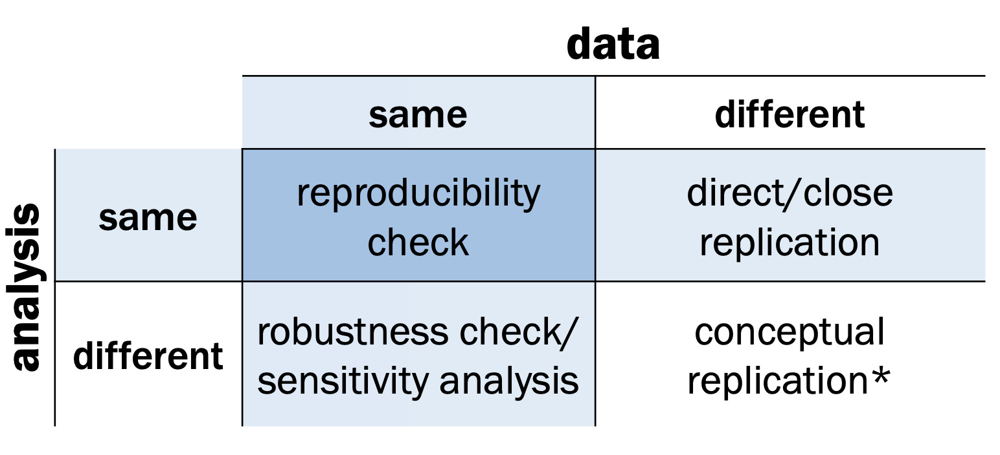
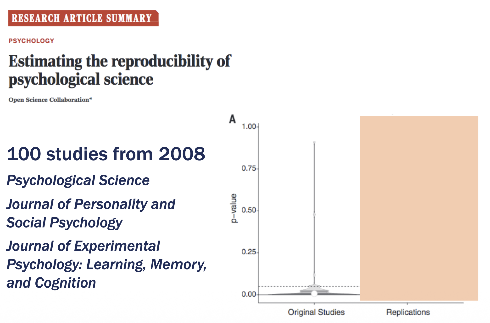
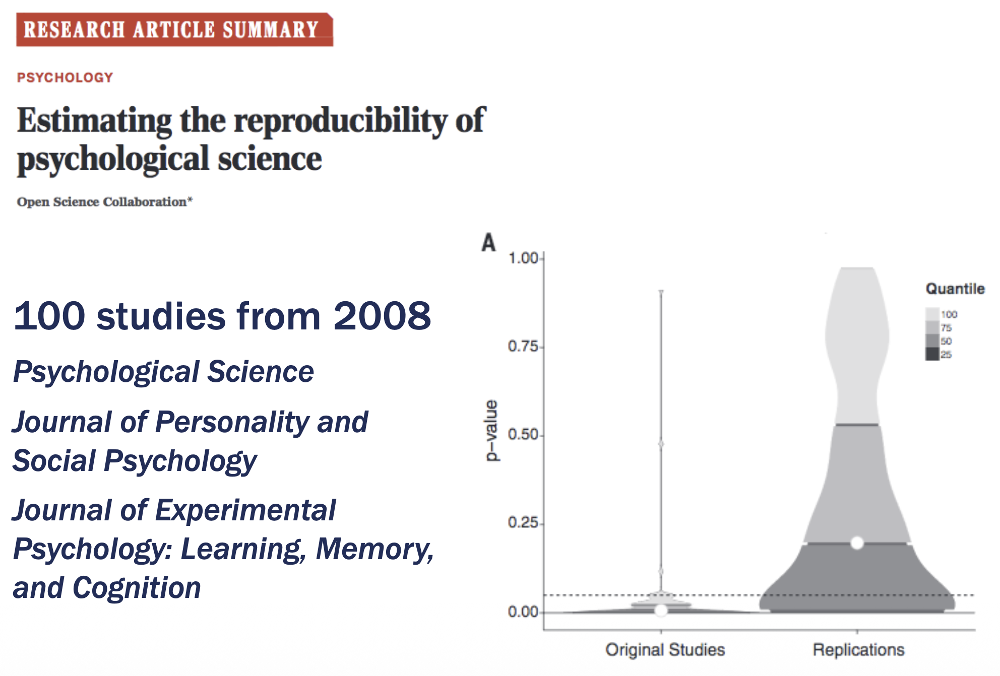
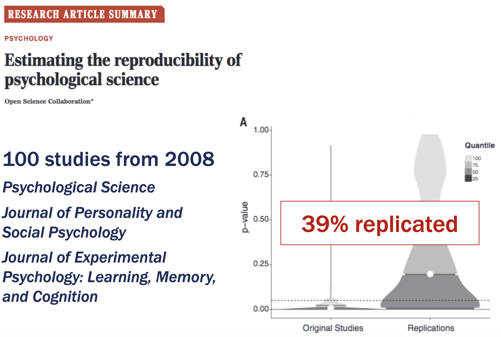
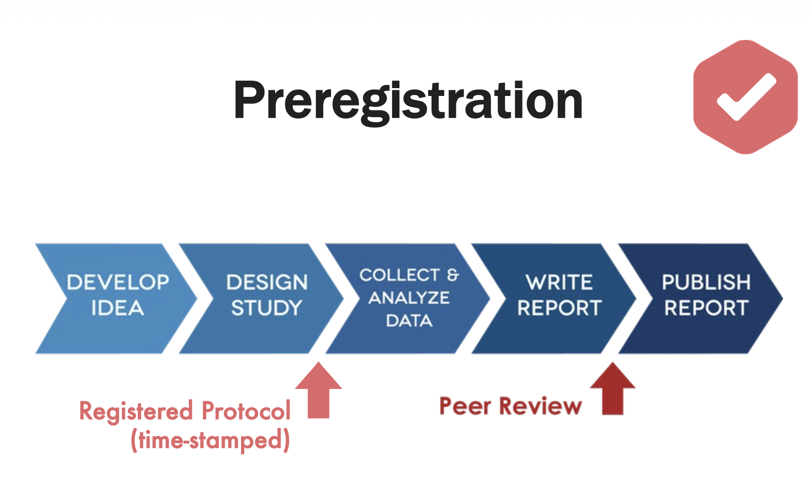
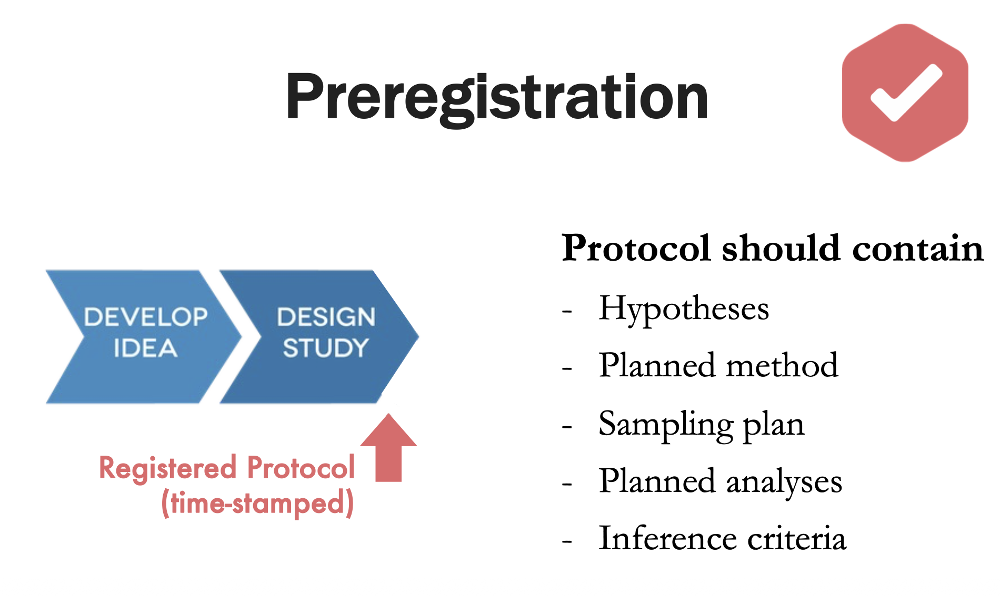
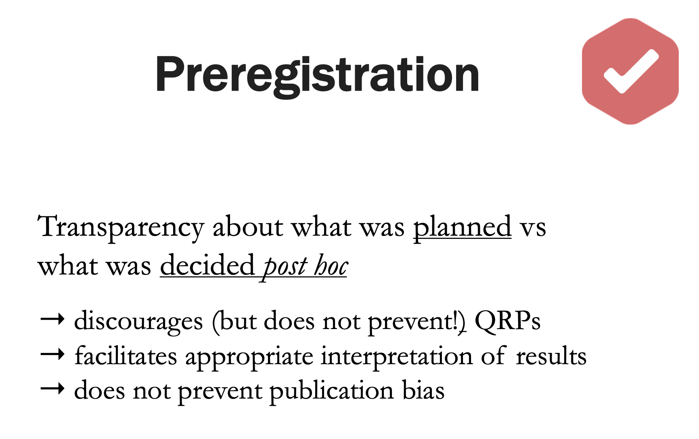

## Disclaimer {.smaller}

I owe a debt of gratitude to many people as the thoughts and code in these slides are the process of years-long development cycles and discussions with my team, friends, colleagues and peers. When someone has contributed to the content of the slides, I have credited their authorship.

This lecture is inspired in part by teaching materials on open science, reproducibility, error prevention and data sharing by Anne Scheel. I have adapted the ideas to the context of applied statistics, public-sector data work and this course.

Scientific references are in the footer. Opinions and examples are my own, AI-supported, or directly linked.

::: {.callout-warning}
You **may use** any and all content in this presentation — including my name — and submit it as input to generative AI tools, with the following **exception**:

- You must ensure that the content is not used for further training of the model.
:::

## Slide materials and source code

::: callout-tip
# Materials
- lecture slides on Moodle
- course page: [www.gerkovink.com/mod12](https://www.gerkovink.com/mod12)
- source: [github.com/gerkovink/mod12](https://github.com/gerkovink/mod12)
:::

## Today

Today we talk about reproducible research.

We focus on one central question:

::: {.callout-note appearance="simple"}
# Core question
Can another person — or your future self — understand, check and rerun the route from **raw data** to **final answer**?
:::

We will discuss:

- why reproducibility matters
- how errors happen
- what a research archive is
- what a minimum viable archive contains
- how to document data, code, output and decisions
- how to declare the role of AI in your project

## Why this matters

Reproducibility is not merely technical neatness.

It is part of:

- scientific integrity
- public-sector accountability
- quality control
- collaboration
- supervision
- future reuse

::: {.callout-tip}
# In Short
A statistical result becomes more trustworthy when the path to it is transparent.
:::

## Replication, reproducibility, robustness



::: footer
Adapted from Anne Scheel's teaching slides on reproducibility and data sharing.
:::

## What can go wrong?

A published claim may fail because:

- the original result was a chance finding
- the analysis involved questionable flexibility
- the study was poorly documented
- files, code or variables are missing
- there was a coding or spreadsheet error
- the wrong data were used
- the result was selectively reported

::: {.callout-warning}
# Be careful
A result can look convincing and still be hard to check.
:::

## Case: reproducibility in psychology

In a large replication effort, 100 studies from leading psychology journals were replicated.



::: footer
Open Science Collaboration (2015). Estimating the reproducibility of psychological science. *Science*. https://doi.org/10.1126/science.aac4716
:::

## Case: reproducibility in psychology

In a large replication effort, 100 studies from leading psychology journals were replicated.



::: footer
Open Science Collaboration (2015). Estimating the reproducibility of psychological science. *Science*. https://doi.org/10.1126/science.aac4716
:::

## Case: reproducibility in psychology

In a large replication effort, 100 studies from leading psychology journals were replicated.



::: footer
Open Science Collaboration (2015). Estimating the reproducibility of psychological science. *Science*. https://doi.org/10.1126/science.aac4716
:::

## Preregistration
{width=50%}

::: footer
Slide from Anne Scheel's teaching slides on preregistration.
:::

## Preregistration
{width=50%}

::: footer
Slide from Anne Scheel's teaching slides on preregistration.
:::

## Preregistration
{width=50%}

::: footer
Slide from Anne Scheel's teaching slides on preregistration.
:::

## Error prevention

A poor strategy is:

<center>Hope that errors won't happen.</center>

A better strategy is:

::: {.callout-tip appearance="simple"}
# Assume errors will happen
Build a workflow that minimizes room for error and makes inevitable errors easier to find.
:::

This is the main design principle behind reproducible research archives.

::: footer
Strand, J. F. (2021). Error Tight: Exercises for Lab Groups to Prevent Research Mistakes. https://doi.org/10.31234/osf.io/rsn5y
:::

## Four pillars of error prevention

::::{.columns}
:::{.column width="50%"}
1. **Automation**

2. **Documentation**

3. **Version control**

4. **Testing / checking**
:::

:::{.column width="50%"}
These are not only for programmers.

They also apply to:

- SPSS syntax
- Stata do-files
- Excel workflows
- Quarto reports
- Word documents
- shared folders
:::
::::

## What is a reproducible research archive?

::: {.callout-note appearance="simple"}
# Reproducible research archive
A structured collection of files that allows another person — or your future self — to understand, check and rerun the path from **data** to **answer**.
:::

The archive documents:

- reasoning
- data
- code or syntax
- outputs
- decisions
- report
- presentation

## Reproducibility is not neatness

::::{.columns}
:::{.column width="50%"}
A neat project:

- looks clean
- has pretty filenames
- feels organized
- may still be impossible to audit
:::

:::{.column width="50%"}
A reproducible project:

- records decisions
- separates raw and cleaned data
- connects scripts to outputs
- documents limitations
- makes claims traceable
:::
::::

::: {.callout-tip}
# In Short
Reproducibility is scientific integrity made visible.
:::

## The archive documents the answer

A good research archive documents five things:

1. **Reasoning**: why this question, design and analysis?
2. **Data**: what data, from where, and under what restrictions?
3. **Processing**: how did raw data become analysis data?
4. **Outputs**: where did each table and figure come from?
5. **Report**: how does the final answer follow from the evidence?

::: {.callout-note}
# Good question to ask yourself
Could a supervisor locate the exact code, syntax, or spreadsheet step behind Table 2 in your report?
:::

## Minimum viable archive
For this course, aim for a **minimum viable archive**:

```text
project-name/
├── README.md
├── data-access-note.md
├── data_raw/              # or placeholder if data cannot be shared
├── data_clean/
├── code/                  # R scripts, SPSS syntax, Stata do-files, notes
├── output/
│   ├── tables/
│   └── figures/
├── report/
├── slides/
├── codebook/
└── decision-log.md
```

::: footer
The Turing Way provides practical guidance on reproducible project structures: https://book.the-turing-way.org/
:::

## README: the front door

The README is the first file someone should open.

It should answer:

- What is this project about?
- Who created it?
- What data are used?
- Which files should be opened first?
- How can the analysis be rerun?
- What software is needed?
- Which parts are private or restricted?

::: {.callout-tip}
# Rule of thumb
If someone cannot start from your README, they cannot audit your project.
:::

## Data access note

Sometimes data cannot be shared.

This is common for:

- government data
- survey microdata
- administrative records
- health data
- education data
- confidential NGO data

A data access note should explain what the data are, who owns them, how access is arranged, and what restrictions apply.

::: footer
UK Data Service guidance emphasizes privacy, ethics and access restrictions when preparing data for sharing: https://ukdataservice.ac.uk/
:::

## Raw data are evidence

::::{.columns}
:::{.column width="45%"}
Bad workflow:

```text
mics2018.xlsx
mics2018_new.xlsx
mics2018_final.xlsx
mics2018_final2.xlsx
mics2018_REALFINAL.xlsx
```
:::

:::{.column width="55%"}
Better workflow:

```text
data_raw/mics2018_original.sav
code/01_clean_data.R
data_clean/mics2018_clean.rds
code/02_analysis.R
output/tables/table1_descriptives.csv
```
:::
::::

::: {.callout-warning}
# Never overwrite raw data
Raw data are the starting point of the evidence trail.
:::

## Number your scripts

Scripts should tell a story in order.

```text
code/
├── 00_setup.R
├── 01_import_data.R
├── 02_clean_variables.R
├── 03_descriptives.R
├── 04_model_wateroverlast.R
├── 05_robustness_checks.R
└── 06_make_figures.R
```

The same principle works in other software:

- `01_clean_data.sps`
- `02_descriptives.do`
- `03_models.xlsx` with documented steps

::: {.callout-tip}
# In Short
Order is a form of documentation.
:::

## Decision log

A decision log records subjective choices.

| Date | Decision | Reason | Effect |
|---|---|---|---|
| 19 Jun | Recoded `don't know` to missing | Not a substantive answer | Reduces complete cases |
| 20 Jun | Combined two education categories | Small cell sizes | More stable estimates |
| 21 Jun | Used survey weights | MICS sample design | Population-relevant estimates |

::: {.callout-important}
# There is no such thing as a neutral workflow
If a choice changes the answer, it belongs in the decision log.
:::

## Codebook or variable dictionary

A codebook connects **columns** to **meaning**.

| Variable | Meaning | Values | Notes |
|---|---|---|---|
| `flood_report` | Household reports wateroverlast | 0 = no, 1 = yes | Self-reported |
| `district` | District of residence | 1–10 | Check labels |
| `drainage` | Access to drainage | 0 = no, 1 = yes | May be observed or reported |
| `weight` | Survey weight | numeric | Use for population estimates |

::: {.callout-tip}
# Columns are not concepts
A variable is a measurement of a construct. The codebook explains the distance between them.
:::

## Make output traceable

Every table and figure in the report should have a known origin.

```text
report/table1_descriptives.qmd
    ↑ uses
output/tables/table1_descriptives.csv
    ↑ produced by
code/03_descriptives.R
    ↑ uses
data_clean/project_clean.rds
    ↑ produced by
code/02_clean_variables.R
```

::: {.callout-note}
# Good question to ask yourself
If I change the cleaning rule today, do I know which tables and figures need to be updated?
:::

## Automation

Automation means: reduce manual copying, clicking and retyping.

Examples:

- generate tables from code instead of typing them into Word
- store figures in an `output/figures/` folder
- use scripts or syntax instead of undocumented point-and-click steps
- use Quarto to connect analysis and report
- export intermediate datasets with clear names

::: {.callout-warning}
# Human memory is not documentation
If the result depends on a manual step, the step needs a trace.
:::

## Version control without drama

Version control can be simple.

At minimum:

```text
report/
├── research-report_2026-06-19.qmd
├── research-report_2026-06-22.qmd
└── research-report_2026-06-25.qmd
```

Better practice: use git or another version control system. At a minimum use version control in a cloud or online environment, such as office365, zenodo, osf, etc

::: {.callout-tip}
# In Short
Version control is a memory system for your project, and thereby for you.
:::

## Testing and checking

Testing does not have to be advanced.

Simple checks are powerful:

- Do the number of rows match expectations?
- Are impossible values present?
- Do category labels match the codebook?
- Do totals in Table 1 match the cleaned dataset?
- Does the same script produce the same figure twice?
- Do reported numbers match the output file?

::: {.callout-note}
# Checkpoints
Put small checks at points where errors are likely: after import, after cleaning, after merging, after filtering and before reporting.
:::

## Data sharing: why?

Sharing is not always possible, but the reasons matter.

Data sharing can support:

- independent checking
- new insights
- collaboration
- efficient supervision
- public value from publicly funded data
- compliance with funders, journals or governments

::: {.callout-tip}
# Nullius in verba
Do not simply take someone's word for it. Make checking possible.
:::

## FAIR is a useful mindset

FAIR asks whether research objects are:

- **Findable**
- **Accessible**
- **Interoperable**
- **Reusable**

FAIR does **not** mean that everything must be public.

It means that people with appropriate permission can find, understand, access and reuse what is ethically and legally shareable.

::: footer
Wilkinson et al. (2016). The FAIR Guiding Principles for scientific data management and stewardship. *Scientific Data*. https://doi.org/10.1038/sdata.2016.18
:::

## Public-sector data: special care
For government, NGO and policy data, reproducibility requires care. Often we cannot share:

- identifiable microdata
- confidential administrative records
- sensitive geographic information
- small-cell tables
- raw interview data

But we can often share:

- metadata
- codebooks
- synthetic examples
- analysis code
- decision logs
- data access notes
- reproducible table shells

## AI-use statement
In this course, document how AI influenced your project. A useful AI-use statement contains:

- which tools were used
- for which tasks
- which prompts or prompt types were used
- what was checked manually
- what was not delegated to AI
- how final responsibility was maintained

::: {.callout-note}
# Example
AI was used to suggest literature search terms and to improve wording. Citations, statistical interpretations and final claims were checked against original sources and remain the responsibility of the author.
:::

## Reproducibility without perfection

You may work in:

- R
- SPSS
- Stata
- Excel
- Quarto or Word
- mixed workflows

That is fine.

The core principle is **traceability**:

<center>What was done? Why was it done? Where did the output come from?</center>

::: {.callout-warning}
# Be careful
A perfectly coded analysis with undocumented data access and unclear decisions is still not reproducible.
:::

## Case: MICS-style survey project

Suppose your project uses household survey data.

A minimum archive may include:

```text
mics_project/
├── README.md
├── data-access-note.md
├── data_raw/README_raw_data_not_shared.md
├── data_clean/households_clean.rds
├── code/01_import_sav.R
├── code/02_clean_child_variables.R
├── code/03_weighted_descriptives.R
├── output/tables/table1_sample.csv
├── output/figures/figure1_dropout_by_mother_education.png
├── report/research-report.qmd
└── decision-log.md
```

::: footer
UNICEF MICS surveys provide questionnaires, reports and microdata documentation for many countries, including Suriname: https://mics.unicef.org/surveys
:::

## What goes into the report?

Your report should not simply say:

> The data were cleaned and analyzed.

It should explain:

- which data were used
- how the analytic sample was created
- how key variables were defined
- how missing values were handled
- which software or workflow was used
- what limitations remain

::: {.callout-tip}
# In Short
The archive is the evidence trail. The report is the argument built on that trail.
:::

## Archive checklist

Before you submit, ask:

1. Can someone identify the final dataset?
2. Can someone find the code or syntax behind each table?
3. Are subjective decisions documented?
4. Are raw data protected from accidental changes?
5. Are restrictions and privacy issues clear?
6. Are software and package versions recorded where possible?
7. Is AI use described honestly?
8. Could your future self continue the project in six months?

## What would a reviewer ask?

Imagine your supervisor asks:

- Why did you exclude these cases?
- Where did Table 3 come from?
- Why are the numbers different from last week?
- How did you define the outcome?
- Why did you use this dataset and not another one?
- Did AI change the interpretation?

::: {.callout-important}
# If you cannot answer from the archive
The archive is not yet doing its job.
:::

## To conclude

Reproducibility is not about being perfect. It is about making your research accountable.

- A clear archive makes supervision easier
- A clear archive makes collaboration easier
- A clear archive makes mistakes easier to find
- A clear archive makes your final answer more credible

::: {.callout-warning appearance="simple"}
# Final principle
A statistical answer is not only a number. It is a traceable route from question to evidence to claim.
:::

## Goal for today

Today we will create the first version of your research archive.

At minimum, you will start with:

- a project folder structure
- a README
- a data access note if needed
- a decision log
- a codebook or variable dictionary
- a plan for tracing tables and figures
- a short AI-use statement

::: {.callout-tip}
# Goal
By the end of today's session, your project should be easier to inspect than it was at the start.
:::
