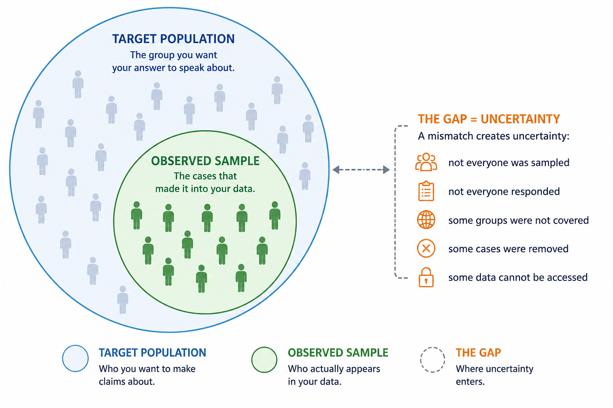

## Disclaimer {.smaller}
I owe a debt of gratitude to many people as the thoughts and code in these slides are the process of years-long development cycles and discussions with my team, friends, colleagues and peers. When someone has contributed to the content of the slides, I have credited their authorship.

Images are either directly linked, or generated with some AI tool. That said, there is no information in this presentation that exceeds legal use of copyright materials in academic settings, or that should not be part of the public domain. 

::: {.callout-warning}
You **may use** any and all content in this presentation - including my name - and submit it as input to generative AI tools, with the following **exception**:

- You must ensure that the content is not used for further training of the model
:::

## Slide materials and source code
::: callout-tip
# Materials
- lecture slides on Moodle
- course page: [www.gerkovink.com/mod12](https://www.gerkovink.com/mod12)
- source: [github.com/gerkovink/mod12](https://github.com/gerkovink/mod12)
:::

## Recap

In the previous lecture we discussed how to make your research reproducible. We learned about the importance of transparency, traceability, and documentation in the research process. We also talked about how to structure your project and what components should be included in a reproducible research archive.


## Today

::: {.callout-note appearance="simple"}
# Core idea
Data are not neutral facts. Data are constructed evidence.
:::

Today we discuss:

1. data provenance
2. units, populations, and variables
3. dark data
4. survey and public-sector data issues
5. data quality as part of the research answer

## The innocent spreadsheet

A data file can look clean:

| district | flooded | income | drainage | weight |
|---|---:|---:|---:|---:|
| Paramaribo | 1 | 2 | 0 | 1.42 |
| Wanica | 0 | 3 | 1 | 0.86 |
| Nickerie | 1 | 1 | 0 | 1.12 |

But each column hides a story:

- who collected this?
- what counted as "flooded"?
- who was not reached?
- why is there a weight?
- what is the population behind these rows?

::: {.callout-important}
# The trap
A clean data file is not the same as clean evidence.
:::

## Data provenance

::: {.callout-tip appearance="simple"}
# Data provenance
The history of how data came into existence, moved through systems, and became available for analysis.
:::

Good provenance questions:

- Who collected the data?
- For what purpose?
- Under what procedures?
- With what definitions?
- For whom or what are the data representative?

::: footer
See Groves et al. (2009). *Survey Methodology*. Wiley; also see UNICEF MICS documentation and World Bank Microdata Library for examples of survey documentation.
:::

## Example: MICS Suriname 2018

The Suriname 2018 Multiple Indicator Cluster Survey was designed to provide high quality data on 

- children
- adolescents
- women
- households 

This is a powerful dataset. It is also a dataset with a purpose.

### Ask yourself
If the MICS survey was designed to monitor children, women, households, and SDGs, what questions is it naturally good for?

What questions might it not be good for?

::: footer
UNICEF MICS Suriname 2018 Survey Findings Report and World Bank Microdata Library: [Suriname MICS 2018](https://microdata.worldbank.org/index.php/catalog/3531).
:::

## Good for
Questions about the living conditions, health, education, protection, and well-being of children, adolescents, women, and households. For example:

* How many children are attending school?
* What share of children are vaccinated or have access to basic health services?
* What are household living conditions like?
* Do households have access to clean water, sanitation, electricity, or the internet?
* What are patterns in child nutrition, child discipline, early childhood development, or child marriage?
* How do outcomes differ by region, wealth, gender, ethnicity, or urban/rural location?
* How is Suriname performing on selected Sustainable Development Goal indicators?

In short, it is good for population-level descriptive questions about the groups and indicators it was designed to monitor.

## Not good for
Questions outside that purpose, especially questions that require detailed information on topics the survey was not designed to measure. For example:

* Detailed questions about adult men, employers, firms, or the labor market.
* Questions about income, wealth, taxation, or macroeconomic performance beyond basic household indicators.
* Highly localized questions about small villages or neighborhoods if the sample is not large enough.
* Questions about rare events or very small subgroups.
* Questions requiring causal answers, such as “Did this policy cause school attendance to improve?”
* Questions about changes over time, unless comparable surveys from other years are used.
* Questions requiring clinical, administrative, or real-time data.

## Unit of observation vs unit of analysis

These are often confused.

| Concept | Meaning | Example |
|---|---|---|
| Unit of observation | What one row describes | child, household, person, plot, district-year |
| Unit of analysis | What your question is about | child learning, household risk, district trend |

::: {.callout-important}
# Be careful
You can have child-level data, household-level predictors, and district-level weather in one project.

That does not make all units interchangeable.
:::

## Population, sample, and target
{width=70%}

**Key question:** Are you analyzing the population you care about, or the population the data happened to capture?


## Variables are measurements

A variable is not a concept (the abstract thing you care about theoretically, before you decide how to observe it in data).

| Concept | Possible measurement | Possible problem |
|---|---|---|
| Poverty | income, assets, deprivation index | underreporting, informal economy |
| Trust | survey question | translation, scale interpretation |
| Flood exposure | self-report, map overlay, sensor | recall bias, spatial mismatch |
| Health | diagnosis, symptoms, biomarker | access to care, measurement error |

::: {.callout-tip}
# In short
A variable name says what the data is supposed to represent. The measurement process tells you what it actually captures
:::

## Administrative categories are built for decisions

Public-sector data usually records **what an institution needed to decide or manage**.

| Administrative category | Created to answer | But often used as a proxy for |
|---|---|---|
| Receives social assistance | Who qualifies for support? | Poverty |
| Registered at school | Who is enrolled? | Education participation |
| Has a diagnosis | Who received care? | Health status |
| Filed a disaster report | Who reported damage? | Disaster impact |

::: {.callout-warning}
# Key question
Does this category measure the thing itself, or only the part that became visible to the system?
:::


## Dark data

**Dark data** is information you need for a correct answer, but do not observe.

It may be absent because it was:

- not asked
- not answered
- not recorded
- not covered
- not linkable
- not accessible

::: {.callout-tip}
# Core idea
The problem is not only what is in the dataset. It is also what is missing from it.
:::

## A small taxonomy of darkness

| Dark data problem | Simple example | Why it matters |
|---|---|---|
| Missing values | income left blank | poverty may be underestimated |
| Nonresponse | remote households not interviewed | vulnerable groups may disappear |
| Undercoverage | informal workers absent from registers | official employment looks too positive |
| Unmeasured confounding | drainage quality not measured | flood risk may be explained incorrectly |
| Changed definitions | benefit categories revised | a data break may look like real change |
| Restricted access | exact locations unavailable | spatial patterns become harder to study |

::: {.callout-warning}
# Ask yourself
What would need to be observed outside the dataset for this analysis to be trustworthy?
:::

## Case: Spaceshuttle Challenger
36 years ago, on 28 January 1986, 73 seconds into its flight and at an altitude of 9 miles, the space shuttle Challenger experienced an enormous fireball caused by one of its two booster rockets and broke up. The crew compartment continued its trajectory, reaching an altitude of 12 miles, before falling into the Atlantic. All seven crew members, consisting of five astronauts and two payload specialists, were killed.

::::{.columns}
:::{.column width="40%"}
{width=90%}
:::
:::{.column width="60%"}
```{r failure, echo = FALSE, message=FALSE, warning=FALSE, fig.height = 4, fig.width=6}
library(tidyverse)
library(ggplot2)
library(alr4)
set.seed(123)
Challeng %>%
  filter(fail > 0) %>%
  ggplot(aes(temp, fail)) +
  geom_point() +
  #geom_(height = .1, width = .01) +
  geom_smooth(method = "lm", se = FALSE) +
  ylim(0, 5) + xlim(52, 76) +
  ylab("Number of distressed O−rings at each launch") +
  xlab("Temperature in degrees Fahrenheit") +
  theme_classic()
```
:::
::::

## Nothing happened, so we ignored it

::::{.columns}
:::{.column width="50%"}
```{r darkdata, echo = FALSE, message=FALSE, warning=FALSE, fig.width = 5}
set.seed(123)
Challeng %>%
  ggplot(aes(temp, fail)) +
  geom_point() +
  geom_smooth(method = "lm", se = FALSE) +
  ylim(0, 5) + xlim(52, 76) +
  ylab("Number of distressed O−rings at each launch") +
  xlab("Temperature in degrees Fahrenheit") +
  theme_classic()
```
:::
:::{.column width="50%"}
In the decision to proceed with the launch, there was a presence of dark data. And no-one noticed!

Dark data
: Information that is not available but necessary to arrive at the correct answer.

This missing information has the potential to mislead people. The notion that we can be misled is essential because it also implies that artificial intelligence can be misled!

::: {.callout-warning appearance="simple"}
If you don’t have all the information, there is always the possibility of drawing an incorrect conclusion or making a wrong decision.
:::

:::
::::


## Example: flood risk in Paramaribo

The World Bank's strategic flood risk assessment for Paramaribo emphasizes coastal, fluvial, and pluvial flood risk, drainage, land use, and climate-related challenges.

A household survey about wateroverlast may observe **reported water nuisance**.

It may not observe:

- exact water depth
- blocked drainage at the time of rainfall
- illegal dumping
- elevation at household level
- previous mitigation actions
- households that moved away after repeated floods


::: {.callout-important}
If you can think of a missing variable that could change your conclusion, it should be researched. If that is not possible, it at least belongs in your limitation section.
:::

## Survey data: design is part of the data

Survey data are not just rows.They often include:

- strata
- clusters
- sampling weights
- household selection procedures
- response rates
- eligibility rules
- questionnaire routing

::: {.callout-tip}
# Good practice
Always read the methodology section before touching the analysis file.
:::

::: footer
UNICEF MICS programme documentation and survey reports include questionnaires, sampling design information, and weights. See [MICS surveys](https://mics.unicef.org/surveys).
:::

## Why weights exist

Weights often correct for:

- unequal selection probabilities
- nonresponse adjustments
- calibration to known population totals

A weighted answer and an unweighted answer can differ.

::: {.callout-warning}
# Be careful
If a survey was designed with weights, ignoring them may change the reference to the population your answer speaks about.
:::

## Clustering and stratification
::: {.callout-tip}
# What is the difference?
::::{.columns}
:::{.column width="50%"}
### Clustering
People in the same cluster may be more similar than people in different clusters.

Examples:

- households in the same enumeration area$^*$ 
- students in the same school
- workers in the same organization
:::

:::{.column width="50%"}
### Stratification
Sampling may be organized to guarantee representation across subgroups.

Examples:

- district
- urban/rural area
- region
- demographic groups
:::
::::
:::

Ignoring design can make uncertainty look smaller than it is.

::: footer
$^*$the geographic boundary assigned to a single census taker or data collector during a demographic count or survey
:::

## Public-sector data: collected to run systems

Administrative data are created when government does something: pays benefits, registers students, gives permits, records damage, or enforces rules.

That means the numbers can change for two different reasons:

| What changed? | Example | What you might wrongly conclude |
|---|---|---|
| The world changed | More households experienced flood damage | Flood damage increased |
| The system changed | Reporting became easier through an online form | Flood damage increased |
| The rules changed | More people became eligible for a benefit | Poverty increased |
| The definition changed | A category was renamed or split | A new trend appeared |

::: {.callout-important}
# Trend warning for long-term data collection efforts
Before interpreting a trend as real-world change, it is good procedure to ask whether the way the data were collected might have changed.
:::

## Codebooks are not optional

A codebook tells you:

- variable meanings
- value labels
- missing value codes
- skip patterns
- questionnaire wording
- units and scales
- eligibility restrictions

::: {.callout-warning}
# Classic mistake
Treating `99`, `999`, `-8`, or `Don't know` as real numbers.
:::

# Case: When you know you're wrong

## Scenario
In a survey about research integrity and fraud we surveyed behaviours and practices in the following format.

<center>
{width=60%}
</center>
<br>
Many behaviours were surveyed over multiple groups of people. Some findings:

- In most groups similar behavioural prevalence was observed.
- When looking at subgroups, prevalences differ between subgroups.
- Not applicables were much more prevalent in one group than in other groups
- There are too few cases and too many patterns with `Not Applicable`'s over features to allow for a pattern-wise analysis (stratified analysis).
- There are too many `Not Applicables` to allow for *listwise deletion*.

## Some background
We know:

1. `Not Applicable` is not randomly distributed over the data. Removing them is therefore not valid!
2. `Not Applicable` are bonafide missing values: there should be no observations.

::: callout-important
# There's no such thing as a free lunch

Every imputation will bias the results. For some we know the direction of the bias, for some we have no idea. We do not have access to the truth.
:::

### What would you do?

## Our solution
We chose to impute the data as `1 (never)`. There are a couple of reasons why we think that this is the best defendable scenario.

1. `Never` has a semantic similarity to a behaviour not being applicable. However,  `Never` implies intentionality; `Not Applicable` does not.
2. We know the effect the imputation has on the inference: Filling in `Never` will underestimate intentional behaviours.

In this case the choice was made to make a **deliberate error**. The estimates obtained would serve as an underestimation of *true behaviour* and can be considered a lower bound estimation.

## Data biography

For your project, write a short biography of the dataset.

| Field | Your entry |
|---|---|
| Dataset name |  |
| Data owner/source |  |
| Original purpose |  |
| Unit of observation |  |
| Target population |  |
| Observed sample |  |
| Time period |  |
| Sampling/selection |  |
| Weights/design variables |  |
| Key variables |  |
| Missing/unavailable variables |  |
| Ethical/access restrictions |  |
| Good for |  |
| Cannot answer |  |

## Data quality is not a paragraph at the end

Data (i.e. information) quality shapes your whole document, from the title to the conclusion. It should become visible in:

- the research question
- the analysis plan or methods
- the results
- the strength of the claim
- the interpretation
- the limitations
- the recommendation

## Small data can hide real differences
Sometimes the pattern is meaningful, but the dataset is too small to confirm it reliably.

| What you see | Positive interpretation |
|---|---|
| Group A appears higher than Group B | There may be a real difference worth investigating |
| A subgroup shows a clear pattern | The signal may be promising, but needs more observations |
| An estimate has a wide uncertainty interval | The data are compatible with several plausible values |
| Results change when a few cases are removed | More data would help stabilize the conclusion |

::: {.callout-tip}
# Low statistical power does not mean “no difference.”
It means the information may be too limited to detect the difference reliably.
:::

::: {.callout-important}
# Better conclusion
The evidence is promising, but more observations are needed before drawing a firm conclusion.
:::

## Claim language

Limited data can still be useful.The key is to match the strength of the claim to the strength of the evidence.

| When the evidence is limited | Say this instead |
|---|---|
| X causes Y | X may contribute to Y |
| The population is... | In the observed sample... |
| This proves... | This provides evidence that... |
| There is no difference | We do not have enough evidence to detect a difference |
| The data show no problem | The available data do not show a clear problem |
| We controlled for everything | We accounted for the observed background variables |

::: {.callout-tip}
Be clear about what the data suggest, what they cannot confirm, and what more evidence would help establish.
:::

## To conclude

::: {.callout-important appearance="simple"}
# Your data are witnesses
They can tell you what has been measured and observed. They can also tell you the relation with what might have been. They cannot tell you about the relations they were never able to observe.
:::

Before you start your data analysis, ask:

1. Where did the data come from?
2. What do the variables really measure?
3. Who or what is missing?
4. What design choices shaped the file?
5. What can this dataset answer well?
6. What can it not answer?